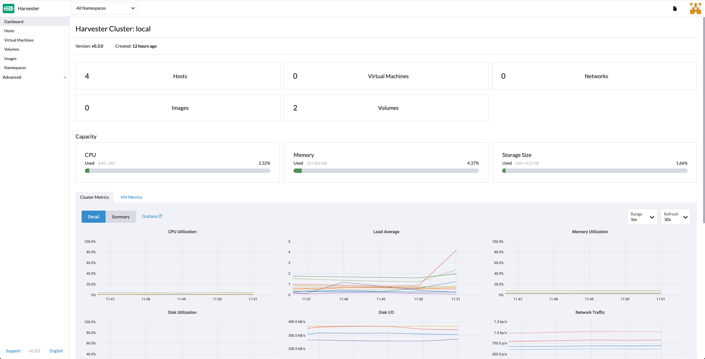
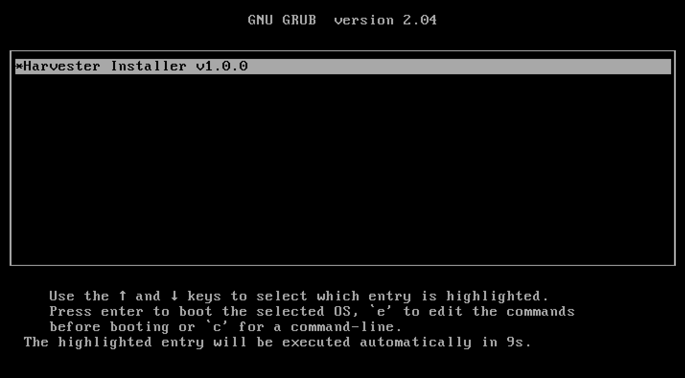
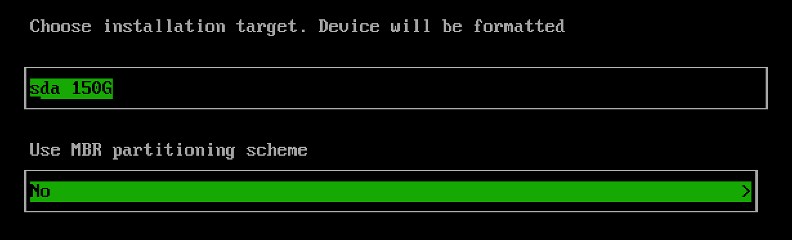
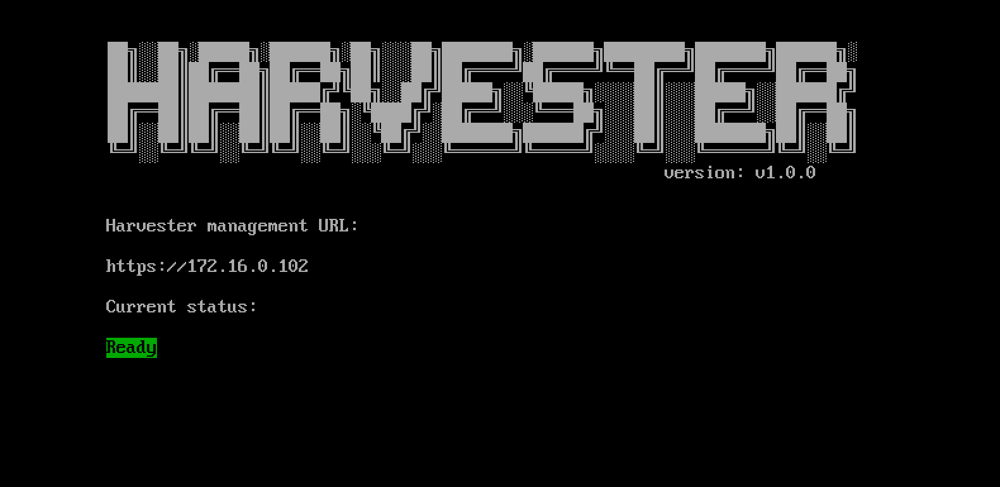

## 概述

Harvester 是基于 Kubernetes 构建的开源[超融合基础架构](https://en.wikipedia.org/wiki/Hyper-converged_infrastructure) (HCI) 软件。它是使用专有 HCI 堆栈的一种开放替代方案，该堆栈结合了 [Cloud Native Computing](https://en.wikipedia.org/wiki/Cloud_native_computing) 的设计和精神。

## Harvester 功能

Harvester 支持在裸机服务器上实施 HCI。Harvester 使用本地、直接连接的存储，而不是复杂的外部 SANs。它提供了一个可集成启动的镜像进行交付，可以通过 ISO 或 PXE 引导直接部署到服务器上。

以下是 Harvester 当下提供的一些主要功能：

1. 虚拟机生命周期管理，包括 SSH-Key 注入、Cloud-init配置、和图形、串行端口控制台。
1. 虚拟机热迁移支持。
1. 虚拟机备份和恢复。
1. 分布式块存储。
1. 虚拟机中的多个网卡支持、可连接到管理或 VLAN网络。
1. 虚拟机和 cloud-init 模板。
1. 集成 [Rancher](https://github.com/rancher/rancher) 并提供多集群管理和 Harvester 主机驱动。
1. [PXE/iPXE 引导支持](./install/pxe-boot-install/_index)
1. 虚拟 IP(VIP) 和 Bond 网卡支持
1. 监控集成

## Harvester 架构
下图为 Harvester 的概览架构：

- [Longhorn](https://longhorn.io/) 是一个轻量级、可靠、易用的 Kubernetes 分布式块存储系统。
- [KubeVirt](https://kubevirt.io/) 是一个 Kubernetes 的虚拟机管理插件。
- [Elemental for openSUSE Leap 15.3](https://github.com/rancher-sandbox/cOS-toolkit) 是一个定制的 Linux 发行版，旨在尽量减少 Kubernetes 集群中节点的操作系统维护工作。

## 硬件要求

硬件需要满足以下要求，才可以启动和运行 Harvester：

| 类型 | 要求 |
|:---|:---|
| CPU | 仅支持 x86_64。需要硬件辅助虚拟化。最少需要 8 核处理器，建议使用 16 核处理器。 |
| 内存 | 32 GB（至少）。建议使用 64 GB 或以上的内存。 |
| 磁盘容量 | 140 GB（至少）。建议使用 500 GB 或以上的磁盘。 |
| 磁盘性能 | 每个磁盘 5,000+ 随机 IOPS (SSD/NVMe)。管理节点（前三个节点）必须[对 etcd 而言足够快](https://www.ibm.com/cloud/blog/using-fio-to-tell-whether-your-storage-is-fast-enough-for-etcd)。 |
| 网卡 | 1 Gbps 以太网（至少）。建议使用 10Gbps 或以上的以太网。 |
| 网络交换机 | VLAN 支持所需的端口中继。 |

## 快速开始

你可以通过 [ISO](./install/iso-install/_index.md) 或 [PXE](./install/pxe-boot-install/_index.md) 来安装 Harvester。详情请参见以下说明。

### ISO 安装

你可以使用 ISO，将 Harvester 直接安装在裸金属服务器上，来组成一个 Harvester 集群。用户可以添加一个或多个计算节点到现有的集群。

如果需要获取 Harvester ISO，访问 [GitHub 上的发行版本](https://github.com/harvester/harvester/releases)进行下载。

在安装过程中，你可以选择组建一个新的集群，或者将节点加入到现有的集群中。

1. 安装 Harvester ISO 磁盘并通过选择 `Harvester Installer` 来启动服务器。
   
1. 通过创建新的 Harvester 集群或加入现有集群来选择安装模式。
1. 选择要安装 Harvester 集群的设备。
   - 注意：默认情况下，Harvester 对 UEFI 和 BIOS 使用 [GPT](https://en.wikipedia.org/wiki/GUID_Partition_Table) 分区架构。如果你使用 BIOS 引导，则可以选择 [MBR](https://en.wikipedia.org/wiki/Master_boot_record)。
      
1. 配置主机名并选择管理网络的网络接口。默认情况下，Harvester 将创建一个名为 `harvester-mgmt` 的 Bond 网卡，IP 地址可以通过 DHCP 或静态方法配置。   
   
1. （可选）配置 DNS 服务器；使用逗号作为分隔符。
1. 配置用于访问集群或加入集群中其他节点的 `Virtual IP`（注意：如果你的 IP 地址是通过 DHCP 配置的，则需要在 DHCP 服务器上配置静态 MAC 到 IP 地址的映射，以便拥有持久的虚拟 IP）。
1. 配置 `cluster token`。这个 Token 会用于将其他节点添加到集群中。
1. 为主机配置登录密码。默认的 SSH 用户是 `rancher`。
1. （可选）配置节点的 NTP Server。默认值是 `0.suse.pool.ntp.org`。
1. （可选）如果你需要使用 HTTP 代理来访问外部环境，在此处输入代理的 URL。否则，请留空。
1. （可选）你可以从远端服务器 URL 导入 SSH 密钥。你的 GitHub 公钥可以与 `https://github.com/<username>.keys` 一起使用。
1. （可选）如果你需要使用 [Harvester 配置](./install/harvester-configuration/_index.md)文件来自定义主机，在此处输入 HTTP URL。
1. 确认安装选项后，Harvester 会自动安装到你的主机上。安装过程可能需要几分钟。
1. 主机会在安装完成后重启，然后会显示一个带有管理 URL 和状态的控制台 UI<small>（你可以使用 F12 在 Harvester 控制台和 Shell 之间切换）。</small>
1. 网页界面的默认 URL 是 `https://your-virtual-ip`。
   
1. 在首次登录时，你会收到为默认 `admin` 用户设置密码的提示。
   

<iframe width="950" height="475" src="https://www.youtube.com/embed/Ngsk7m6NYf4" title="YouTube video player" frameborder="0" allow="accelerometer; autoplay; clipboard-write; encrypted-media; gyroscope; picture-in-picture" allowfullscreen></iframe>

### PXE/iPXE 安装

Harvester 可以自动安装。如果需要获取详细的说明和指导，请参见 [PXE 引导安装](./install/pxe-boot-install/_index.md)。

> 注意：
> 你可访问 [harvester/ipxe-examples](https://github.com/harvester/ipxe-examples) 获取更多 iPXE 用法示例。
