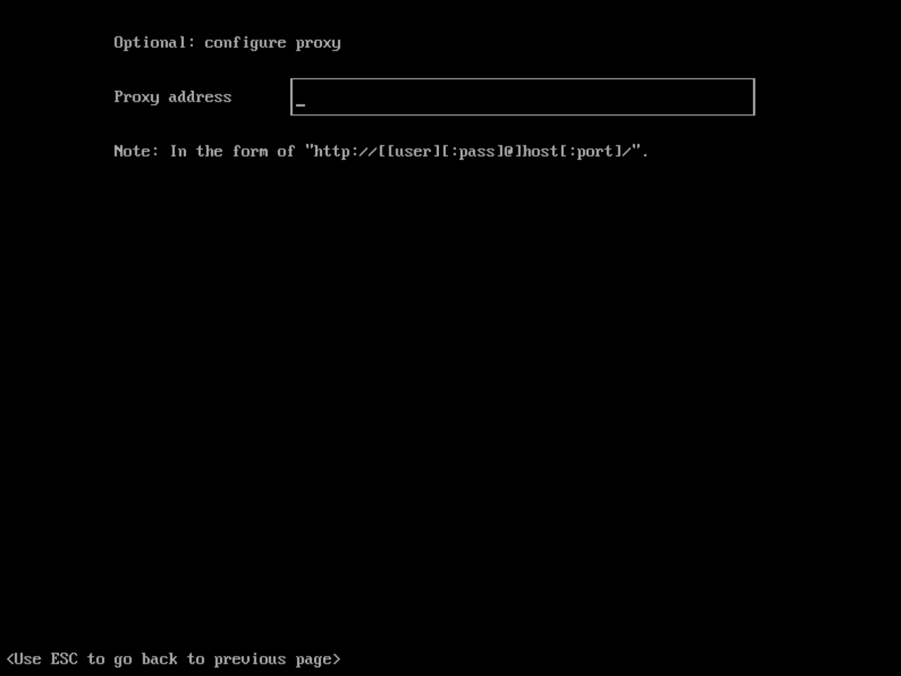
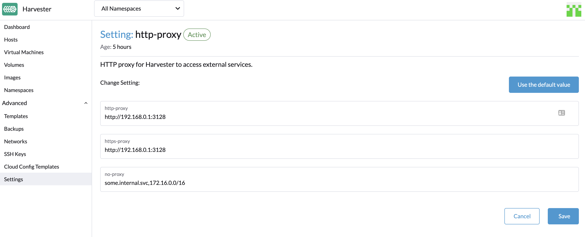

## 概述

本节介绍如何在离线环境中使用 Harvester。在某些用例中，Harvester 会在离线环境，或在防火墙/代理后安装。

Harvester ISO 镜像包括实现在离线环境中运行的所有包。

## 在 HTTP 代理后运行

在某些环境中，从服务器或虚拟机连接到外部服务需要 HTTP(S) 代理。

### 在安装期间配置 HTTP 代理

你可以在 [ISO 安装](../install/iso-install/_index.md)期间配置 HTTP(S) 代理，如下图所示：

### 在 Harvester 设置中配置 HTTP 代理

你可以在 Harvester 仪表盘的设置页面中配置 HTTP(S) 代理：

1. 转到 Harvester UI 的设置页面。
1. 找到 `http-proxy` 设置，点击**⋮ > 编辑设置**
1. 输入 `http-proxy`，`https-proxy` 和 `no-proxy` 的值。

> 注意：
> Harvester 在用户配置的 `no-proxy` 后附加必要的地址，来确保内部流量能正常工作。
> 例如，`localhost,127.0.0.1,0.0.0.0,10.0.0.0/8,cattle-system.svc,.svc,.cluster.local`。
