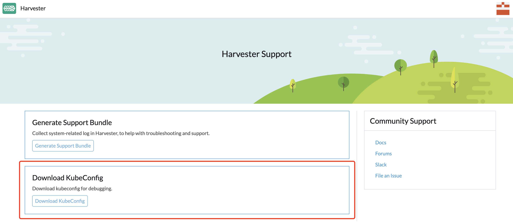

## 概述

本文包含了用户常见的 Harvester 问题。

### 如何通过 SSH 登录到 Harvester 节点？

```shell
$ ssh rancher@node-ip
```

### Harvester 仪表盘的默认登录用户名和密码是什么？

```shell
username: admin
password: # 首次登录时会提示你设置默认密码
```

### 如何访问 Harvester 集群的 kubeconfig 文件？

选项 1：你可以从 Harvester 仪表盘的支持页面下载 kubeconfig 文件。


选项 2：你可以从其中一个 Harvester 管理节点获取 kubeconfig 文件。例如：

```shell
$ cat /etc/rancher/rke2/rke2.yaml
```

### 如何在运行的虚拟机上安装 qemu-guest-agent？

```shell
# cloud-init 只会执行一次。使用以下命令添加 cloud-init 配置后请重新启动它。
$ cloud-init clean --logs --reboot
```

[https://cloudinit.readthedocs.io/en/latest/topics/cli.html#clean](https://cloudinit.readthedocs.io/en/latest/topics/cli.html#clean)

### 如何重置管理员密码？

如果你忘记了管理员密码，请通过命令行进行重置。SSH 到其中一个管理节点并运行以下命令：

```shell
# 切换到 root 并运行：
$ kubectl  -n cattle-system exec $(kubectl --kubeconfig $KUBECONFIG -n cattle-system get pods -l app=rancher --no-headers | head -1 | awk '{ print $1 }') -c rancher -- reset-password
New password for default administrator (user-xxxxx):
<new_password>
```
