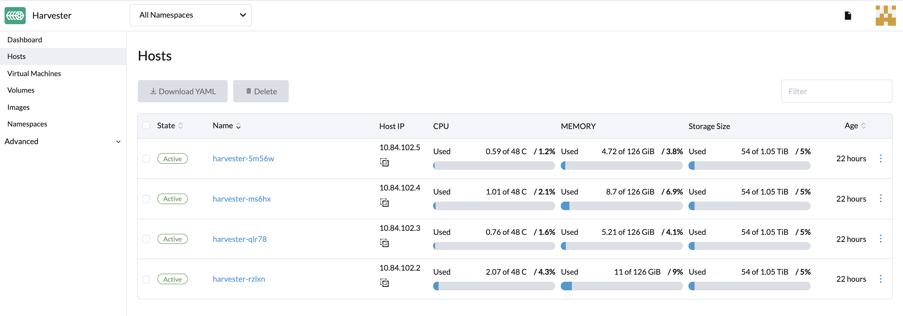
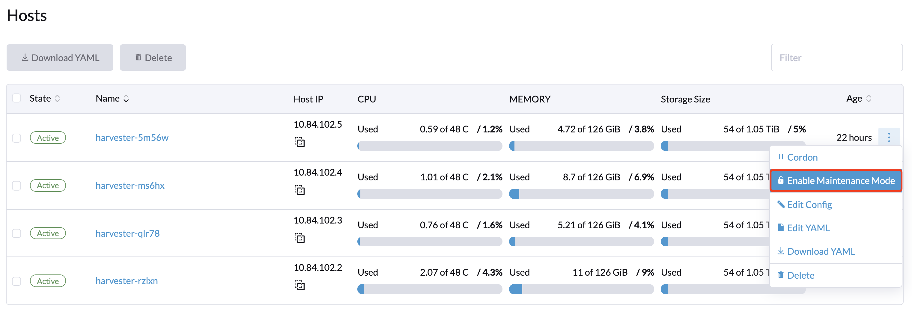
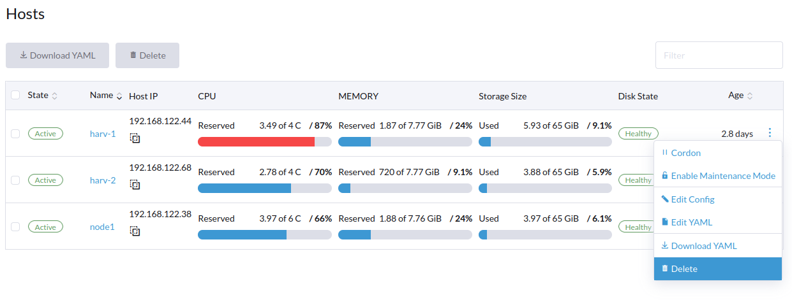
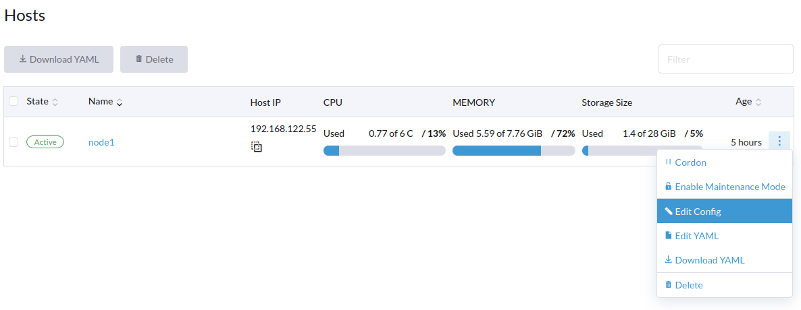
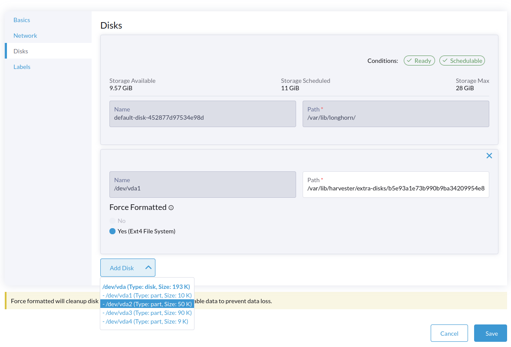

## 概述

用户可以从主机页面查看和管理 Harvester 节点。第一个节点默认为集群的管理节点。当节点数量多于三个时，先加入的另外两个节点会自动升级为管理节点，从而形成一个高可用(HA)集群。

> 注意：
> 由于 Harvester 建立在 Kubernetes 之上并使用 etcd 作为数据库，因此当管理节点的数量是 3 时，最大节点容错为 1。

## 节点维护

Admin 用户可以点击**开启维护模式**来自动驱逐节点中所有的虚拟机。这将使用`虚拟机热迁移`功能，来将所有虚拟机自动迁移到其他节点。要使用这个功能，至少需要有两个 `active` 的节点。

## 封锁节点(Cordon)

封锁节点会将节点标记为不可调度。此功能适用于在短期维护（如重启，升级或停用）时在节点上执行短期任务。完成后，重新打开电源并通过取消封锁使节点再次可调度。

## 删除节点

删除节点有两个步骤：

1. 从 Harvester 删除节点
   - 前往**主机**页面
   - 找到需要修改的节点，点击 **⋮ > 删除**。

2. 在节点中卸载 RKE2
   - 作为`root`用户登录到节点。
   - 运行 `rke2-uninstall.sh` 删除整个 RKE2 服务。

> 注意：
> 节点硬删除存在一个[已知问题](https://github.com/harvester/harvester/issues/1497)。 该问题解决后，可以跳过RKE2节点卸载的步骤。

> 注意：
> 删除 RKE2 服务后，你将丢失 control plane 节点的所有数据。
 
## 多磁盘管理 - `预览版本`

用户可以从主机详情页面查看和添加多个磁盘作为附加数据卷。

1. 前往**主机**页面。
2. 找到需要修改的节点，点击 **⋮ > 编辑配置**。
2. 选择**磁盘**选项卡并点击**添加磁盘**。
3. 选择额外的原始块设备或分区，将其添加为额外的数据卷。
   - 在添加整个原始块设备来组成单个根磁盘分区时，如果使用的是 ext4 文件系统，则需要选择`强制格式化`选项。
   - 在添加分区时，如果文件系统类型为 `ext4`、`XFS` 或找不到的分区时，`强制格式化`选项是可选的。如果添加其他文件系统类型的分区，这个选项是必须的。

