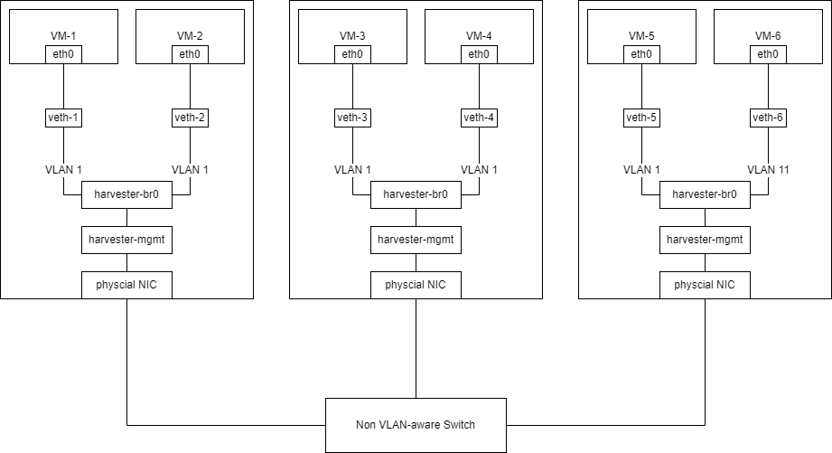
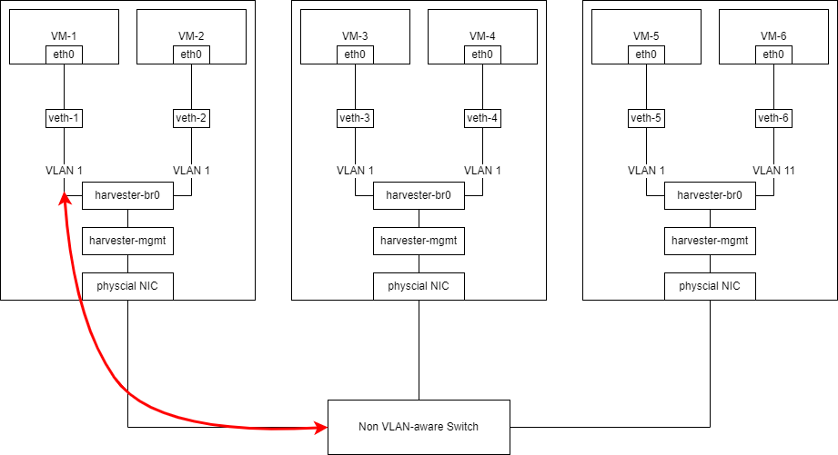

## 概述

在此“非 VLAN 感知”交换机（也称为“虚拟”交换机）的最佳实践指南中，我们将介绍常见场景下的 Harvester VLAN 网络和外部交换机配置。

## 架构

硬件：

- 只有一个单端口网卡的 3 台 Harvester Server。
- 一个或多个“非 VLAN 感知”交换机。

网络规格：

- 主机和 VM 网络位于同一子网中。

布线：

- Harvester Server 从端口 `1` 到端口 `3` 连接到交换机。

下图说明了本指南所用的布线：

## 外部交换机配置

通常情况下，我们无法配置“非 VLAN 感知”交换机。

## 在 Harvester 中创建 VLAN 网络

你可以前往 **Advanced > Networks** 页面，然后点击 **Create** 按钮，来创建一个新的 VLAN 网络。

指定你要为 VLAN 网络设置的名称和 VLAN ID（如果你配置了 [Rancher 多租户](../../rancher/virtualization-management/_index#多租户)，你可以在不同的命名空间中指定相同的 VLAN ID）。

### 将 VM 连接到 Harvester 主机的子网

“非 VLAN 感知”交换机只会将未标记的网络流量发送到 Harvester 主机的子网。在 Harvester 中，未标记的流量在 VLAN 1 中接收。

如果需要将 VM 连接到 Harvester 主机的子网，则必须在 Harvester 中创建一个 VLAN ID 为 1 的 VLAN 网络。

有关 Harvester 网络的更多信息，请参阅[此页面](../../networking/_index)。

> 注意：
> 如果创建 ID 不是 `1` 的 VLAN 网络，不同节点的 VM 之间的连接将失败。
