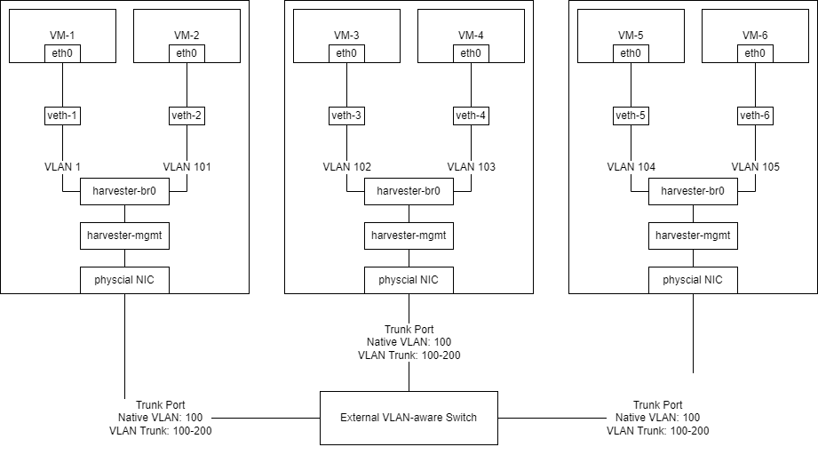
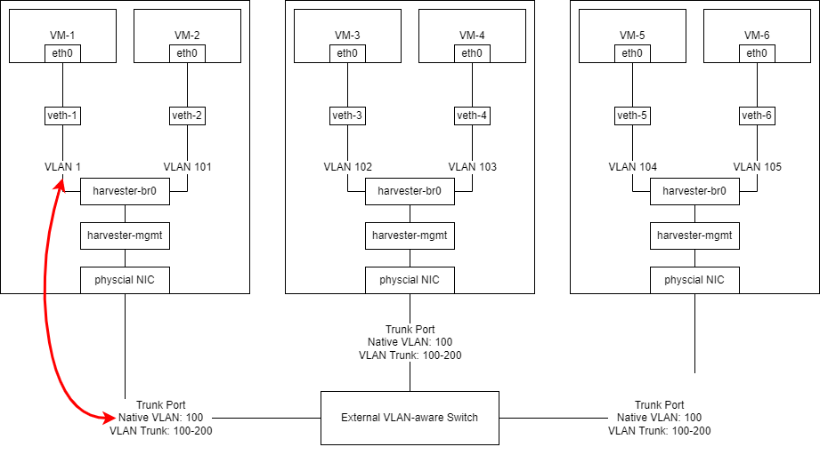

## 概述

在此“VLAN 感知”交换机配置的最佳实践指南中，我们将介绍常见场景下的 Harvester VLAN 网络和外部交换机配置。

## 架构

硬件：

- 只有一个单端口网卡的 3 台 Harvester Server。
- 一个或多个 VLAN 感知交换机。我们将使用类似 Cisco 的配置作为示例。

网络规格：

- 假设 Harvester 主机的子网在 VLAN 100 中。
- 假设 VM 在 VLAN 101-200 中。

布线：

- Harvester Server 从端口 `1` 到端口 `3` 连接到交换机。

下图说明了本指南所用的布线：



## 外部交换机配置

对于外部交换机的网络，我们将使用类似 Cisco 的配置作为示例。你可以将以下配置应用于你的交换机：

```
switch# config terminal
switch(config)# interface ethernet1/<Port Number>
switch(config-if)# switchport
switch(config-if)# switchport mode trunk
switch(config-if)# switchport trunk allowed vlan 100-200
switch(config-if)# switchport trunk native vlan 100
switch(config-if)# no shutdown
switch(config-if)# end
switch# copy running-config startup-config
```

## 在 Harvester 中创建 VLAN 网络

你可以前往 **Advanced > Networks** 页面，然后点击 **Create** 按钮，来创建一个新的 VLAN 网络。

指定你要为 VLAN 网络设置的名称和 VLAN ID（如果你配置了 [Rancher 多租户](../../rancher/virtualization-management/_index#multi-tenancy)，你可以在不同的命名空间中指定相同的 VLAN ID）。


### 将 VM 连接到 Harvester 主机的子网

完成上一节中的配置后，外部交换机会将未标记的网络流量发送到 Harvester 主机的子网。在 Harvester 中，未标记的流量在 VLAN 1 中接收。

因此，如果需要 VM 连接到 VLAN ID 100，则需要在 Harvester 中创建 VLAN ID 1 网络。

外部交换机将从数据包中删除 VLAN 100 标记用于出口，`harvester-br0` 会将 VLAN 1 标记添加到数据包并将其视为 VLAN 1，如下图所示：



> 警告：
> 不要使用 VLAN 100 创建 VLAN 网络并将任何 VM 关联到它。连接性并不总是得到保证，并且取决于外部交换机从数据包中添加/删除 VLAN 标记的操作。

### 将 VM 连接到特定 VLAN 网络

你需要创建一个具有特定 VLAN ID 的 VLAN 网络，并将 VM 关联到该 VLAN 网络。

有关 Harvester 网络的更多信息，请参阅[此页面](../../networking/_index)。
