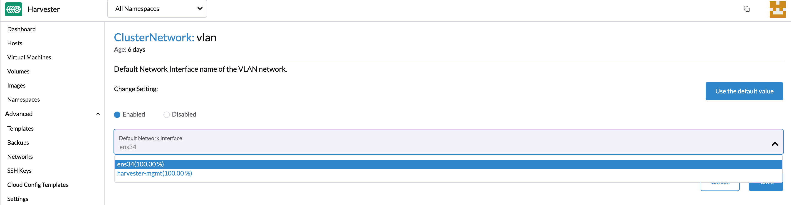
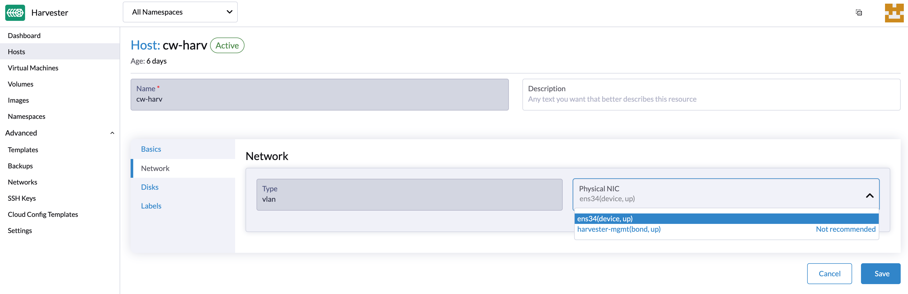
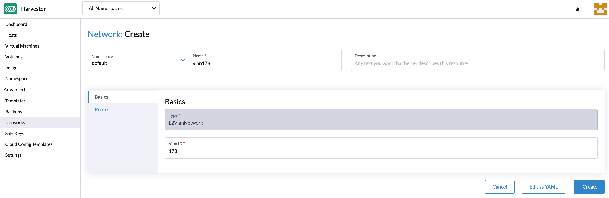
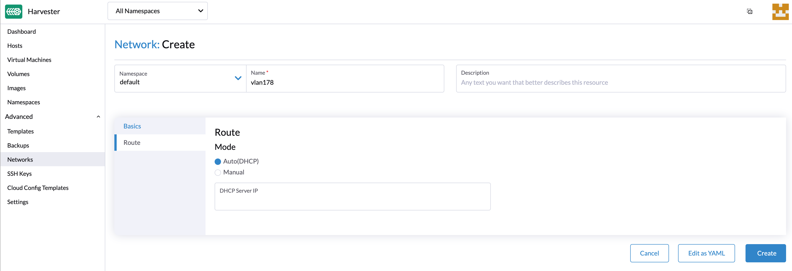
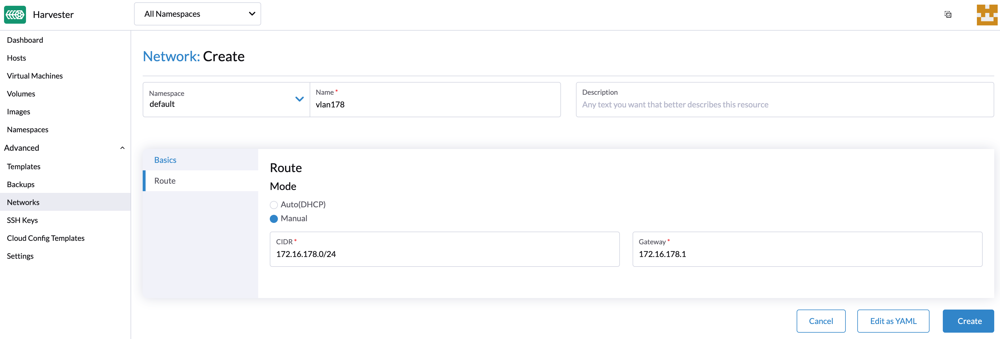
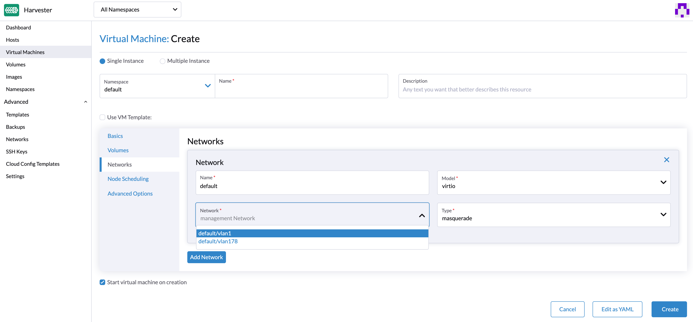

## 概述

Harvester 构建在 [Kubernetes](https://kubernetes.io/) 之上，并使用其内置的 [CNI](https://github.com/containernetworking/cni) 机制来提供网络提供商与虚拟机网络之间的接口。

我们已经实现了基于 [bridge](https://www.cni.dev/plugins/current/main/bridge/) CNI 的 Harvester VLAN 网络，以提供纯 L2 模式网络，从而将你的虚拟机桥接到主机网络接口，并且可以使用物理交换机连接内部和外部网络通信。

此外，Harvester UI 集成了 [harvester-network-controller](https://github.com/harvester/network-controller-harvester) 以提供用户友好的 VLAN 网络配置，例如，创建和管理 VLAN 网络或将 VLAN 网络添加到虚拟机。

目前，Harvester 支持两种类型的网络：

- [管理网络](#管理网络)
- [VLAN 网络](#VLAN-网络)

## 管理网络

Harvester 使用 [canal](https://projectcalico.docs.tigera.io/getting-started/kubernetes/flannel/flannel) 作为默认管理网络。它是一个内置网络，可以直接从集群中使用。
默认情况下，虚拟机的管理网络 IP 只能在集群节点内访问，虚拟机重启后管理网络 IP 会改变。

但是，用户可以利用 Kubernetes [服务对象](https://kubevirt.io/user-guide/virtual_machines/service_objects/) 为你的虚拟机与管理网络创建一个稳定的 IP。

## VLAN 网络

[Harvester network-controller](https://github.com/harvester/harvester-network-controller) 利用 [multus](https://github.com/k8snetworkplumbingwg/multus-cni) 和 [bridge](https://www.cni.dev/plugins/current/main/bridge/) CNI 插件来实现它自定义的 L2 桥接 VLAN 网络。这有助于将你的虚拟机连接到主机网络接口，并且可以使用物理交换机从内部和外部网络进行访问。

下图说明了 VLAN 网络在 Harvester 中的工作方式：


- Harvester network-controller 为每个节点创建一个桥接器，并为每个虚拟机创建一对 veth 来实现 VLAN 网络。网桥充当交换机，转发来自或发往虚拟机的网络流量，而一对 veth 则充当虚拟机和交换机之间的连接端口。
- 同一 VLAN 内的虚拟机能够相互通信，而不同 VLAN 内的虚拟机则不能。
- 与主机或其他设备（如 DHCP 服务器）连接的外部交换机端口应设置为中继或混合类型，并允许指定的 VLAN。
- 用户可以使用带有 `PVID`（默认为 1）的 VLAN 来与任何正常的无标记流量进行通信。

### 启用默认 VLAN 网络

你可以前往**设置 > vlan** 来启用 VLAN 网络。选择`启用`后，你将能够从节点中选择一个网络接口作为默认的 VLAN 网卡配置。

为了获得更好的网络性能和实现隔离，我们建议为 VLAN 和管理网络（即 `harvester-mgmt`）选择不同的网络接口。



> 注意
>
> - 选择网络接口时，括号中的数值代表网络接口在所有主机上的分布百分比。如果选择了小于 100% 的网络接口，需要在 VLAN 网络配置失败的主机上手动指定网络接口。
> - 修改默认 VLAN 网络设置不会更新现有的主机网络配置。
> - Harvester VLAN 网络支持绑定接口。目前只能通过 [PEX 启动配置](/install/harvester-configuration/#example_11)自动创建。你也可以登录到节点并进行手动创建。

你还可以通过**主机 > 网络**选项卡自定义每个节点的 VLAN 网络。



### 创建 VLAN 网络

你可以前往**高级选项 > 网络**页面，并单击**创建**按钮来创建新的 VLAN 网络。

1. 设置 VLAN 网络的名称和 VLAN ID <small>（你可以在 [Rancher 多租户](/rancher/virtualization-management/_index/#多租户) 支持的不同命名空间上指定相同的 VLAN ID）</small>。
   

2. 配置路由以允许主机使用 IPv4 地址连接到 VLAN 网络。VLAN 网络的 CIDR 和网关是路由配置的必备参数。你可以选择以下选项之一来配置路由：
   - 自动（DHCP）：Harvester 网络控制器将使用 DHCP 协议从 DHCP 服务器获取 CIDR 和网关值。你也可以指定 DHCP 服务器地址。
     
   - 手动：你需要自行指定 CIDR 和网关值。
     

### 使用 VLAN 网络创建虚拟机

现在，你可以使用上面配置的 VLAN 网络创建一个新的虚拟机：

- 单击**虚拟机**页面上的**创建**按钮。
- 输入所需参数并单击**网络**选项卡。
- 将默认网络配置为 VLAN 网络，或选择要添加的其他网络。



> 注意
>
> - 默认情况下仅启用第一个网卡。你可以选择使用管理网络或 VLAN 网络。
> - 你需要在**高级选项**选项卡中选择 `安装访客代理`，来从 Harvester UI 获取 VLAN 网络 IP 地址。

- 你可以选择添加一个或多个网卡。默认情况下，可以通过 cloud-init 网络数据设置来启用其他网卡。例如：

```YAML
version: 1
config:
  - type: physical
    name: enp1s0 # name is varies upon OS image
    subnets:
      - type: dhcp
  - type: physical
    name: enp2s0
    subnets:
      - type: DHCP
```

Harvester 与 `cloud-init 网络配置`完全兼容。你可以参考[文档](https://cloudinit.readthedocs.io/en/latest/topics/network-config-format-v2.html)了解更多详情。

### 在网络上配置 DHCP 服务器

默认情况下，Harvester VLAN 网络需要你的路由器提供一个 DHCP 服务器，虚拟机可以自动请求和分配 IP 地址。

如果你在不包含 DHCP 服务器的虚拟环境中运行 Harvester，你可以考虑在节点上手动部署 DHCP 服务器或使用容器化方法，详情请参见 [issue #947](https://github.com/harvester/harvester/issues/947)。
