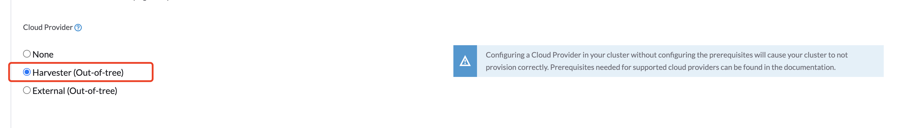
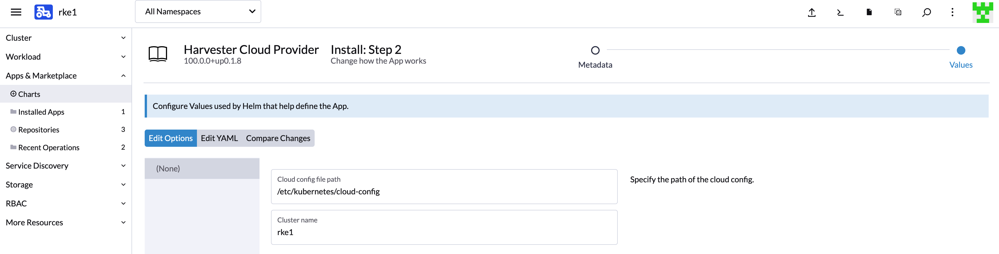
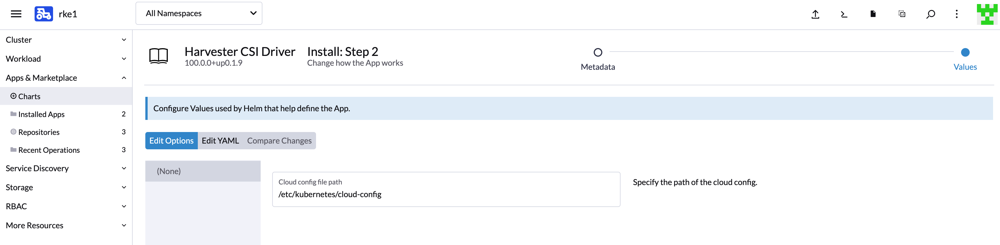
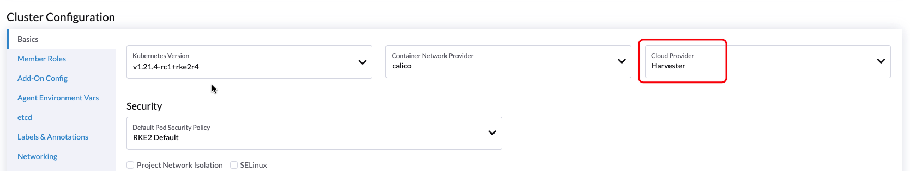
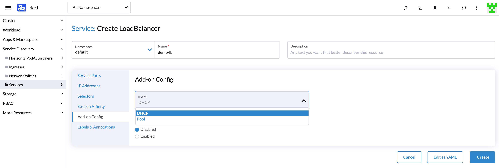
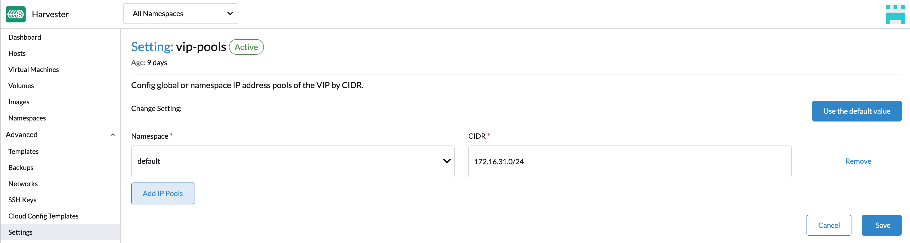
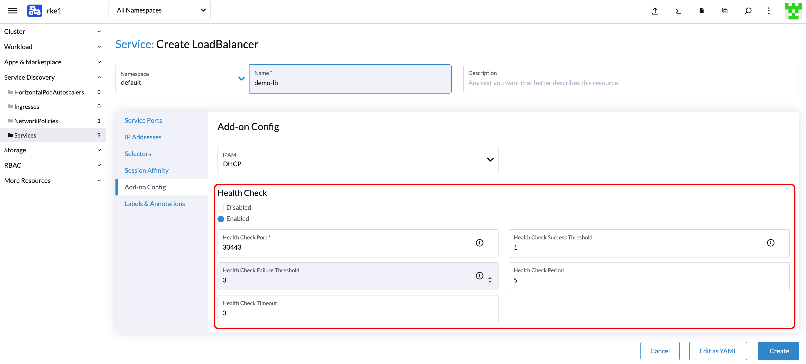

## 概述

你可以使用内置的 Harvester 主机驱动在 Rancher 中配置 [RKE1](../rke1-cluster/_index.md) 和 [RKE2](../rke2-cluster/_index.md) 集群。Harvester 会为这些 Kubernetes 集群提供[负载均衡器](../cloud-provider/_index.md#负载均衡器支持)和[集群持久存储](../csi-driver/_index.md)支持。

你将在本文中学习：

- 如何在 RKE1 和 RKE2 中部署 Harvester Cloud Provider。
- 如何使用 [Harvester 负载均衡器](../cloud-provider/_index.md#负载均衡器支持)。

## 部署

### 前提
- Kubernetes 集群是在 Harvester 虚拟机之上构建的。
- 作为 Kubernetes 节点运行的 Harvester 虚拟机位于相同的命名空间中。

### 使用 Harvester 主机驱动部署到 RKE1 集群
使用 Harvester 主机驱动启动 RKE 集群时，你可以执行两个步骤来部署 `Harvester` 云提供商：

- 选择 `Harvester(Out-of-tree)` 选项。

   

- 从 Rancher 应用市场中安装 `Harvester Cloud Provider`。

   

> 注意：
> 你需要指定`集群名称`。如果未指定`集群名称`，则会使用默认值 `kubernetes`。`集群名称`用来区分 Harvester 负载均衡器的所有权。

- 如有需要，从 Rancher 应用市场中安装 `Harvester CSI Driver`。

   

### 使用 Harvester 主机驱动部署到 RKE2 集群
使用 Harvester 主机驱动启动 RKE2 集群时，选择 `Harvester` 云提供商。然后，主机驱动将自动部署 CSI 驱动和 CCM。

## 负载均衡器支持
部署 `Harvester Cloud Provider` 后，你可以使用 Kubernetes `LoadBalancer` 服务将集群内的微服务公开给外部。在你创建 Kubernetes `LoadBalancer` 服务时，会为该服务分配一个 Harvester 负载均衡器，你可以通过 Rancher UI 中的`附加配置`对其进行编辑。

### IPAM
Harvester 的内置负载均衡器同时支持 `pool` 和 `dhcp` 模式。你可以在 Rancher UI 中选择模式。Harvester 将注释 `cloudprovider.harvesterhci.io/healthcheck-port` 添加到后面的服务中。

- pool：需要提前在 Harvester 中配置一个 IP 地址池。Harvester LoadBalancer Controller 将从 IP 地址池中为负载均衡器分配一个 IP 地址。

   

- dhcp：需要 DHCP 服务器。Harvester LoadBalancer Controller 将从 DHCP 服务器请求 IP 地址。

> 注意：
> 不允许修改 IPAM 模式。如果需要修改 IPAM 模式，你需要创建一个新服务。

### 健康检查
Harvester 负载均衡器支持 TCP 健康检查。如果启用了`健康检查`选项，你可以在 Rancher UI 中指定参数。

你也可以手动将注释添加到服务来指定参数。支持以下注释：

| 注释键 | 值类型 | 是否必须 | 描述 |
|:---|:---|:---|:---|
| `cloudprovider.harvesterhci.io/healthcheck-port` | string | true | 指定端口。探针将访问由后端服务器 IP 和端口组成的地址。 |
| `cloudprovider.harvesterhci.io/healthcheck-success-threshold` | string | false | 指定健康检查成功阈值。默认值为 1。如果探针连续检测到某个地址的成功次数达到成功阈值，后端服务器就可以开始转发流量。 |
| `cloudprovider.harvesterhci.io/healthcheck-failure-threshold` | string | false | 指定健康检查失败阈值。默认值为 3。如果健康检查失败的数量达到失败阈值，后端服务器将停止转发流量。 |
| `cloudprovider.harvesterhci.io/healthcheck-periodseconds` | string | false | 指定健康检查周期。默认值为 5 秒。 |
| `cloudprovider.harvesterhci.io/healthcheck-timeoutseconds` | string | false | 指定每次健康检查的超时时间。默认值为 3 秒。 |

> 注意：
> 目前，健康检查的端口需要是一个 `nodeport`。如果需要将其更改为服务端口则需要发起[功能请求](https://github.com/harvester/harvester/issues/1697)。未来的版本将实现这一功能。

