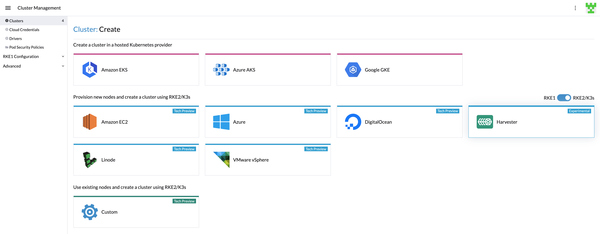
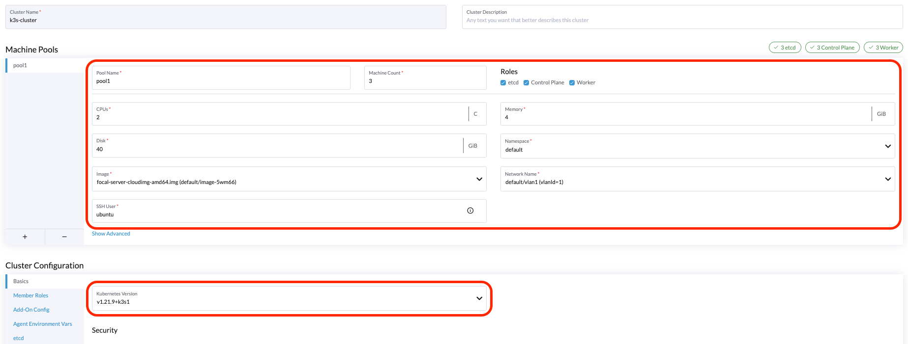

## 概述

你可以使用内置的 Harvester 主机驱动在 Rancher `2.6.3` 中配置在 Harvester 集群之上的 K3s Kubernetes 集群。



> 注意
> - Harvester K3s 主机驱动处于技术预览阶段。
> - Harvester 主机驱动需要 [VLAN 网络](../../networking/_index#创建-vlan-网络)。

### 创建你的云凭证

1. 单击**☰ > 集群管理**。
2. 单击**云凭证**。
3. 单击**创建**。
4. 单击 **Harvester**.
5. 输入你的云凭证名称。
6. 选择**导入的 Harvester** 或**外部 Harvester**。
7. 单击**创建**。


### 创建 K3s Kubernetes 集群

你可以通过 K3s 主机驱动从**集群管理**页面创建 K3s Kubernetes 集群。

1. 点击**集群**菜单。
2. 点击**创建**按钮。
3. 切换到 **RKE2/K3s**。
4. 选择 Harvester 主机驱动。
5. 选择**云凭证**。
6. 输入**集群名称**（必须）。
7. 选择**命名空间**（必须）。
8. 选择**镜像**（必须）。
9. 选择**网络**（必须）。
10. 输入 **SSH 用户名**（必须）。
11. 单击**创建**。



### 在离线环境中使用 Harvester K3s 主机驱动

K3s 配置依赖 `qemu-guest-agent` 来获取虚拟机的 IP。但是，在离线环境中安装 `qemu-guest-agent` 可能不可行。

你可以使用以下选项解决安装限制：

选项 1：使用安装了 `qemu-guest-agent` 的虚拟机镜像。

选项 2：配置 `cloud init` 用户数据，使虚拟机能够通过 HTTP(S) 代理安装 `qemu-guest-agent`。

Harvester 节点模板中的`用户数据`示例：
```
#cloud-config
apt:
  http_proxy: http://192.168.0.1:3128
  https_proxy: http://192.168.0.1:3128
```
