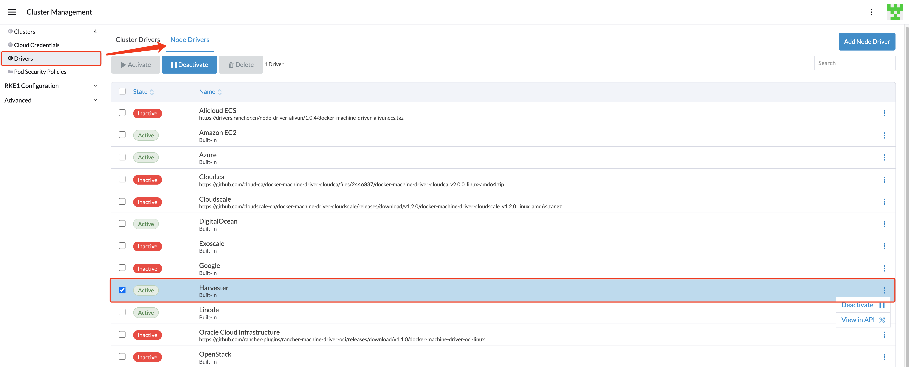

## 概述

Harvester 主机驱动用于在 Harvester 集群中配置虚拟机。在本节中，你将学习如何配置 Rancher 以使用 Harvester 主机驱动来启动和管理 Kubernetes 集群。

Node Driver 的设计与 [Docker Machine Driver](https://docs.docker.com/machine/) 相同，它的项目仓库位于 [harvester/docker-machine-driver-harvester](https://github.com/harvester/docker-machine-driver-harvester)。

你可以使用内置的 Harvester 主机驱动在 Rancher `2.6.3+` 中配置 RKE1/RKE2 Kubernetes 集群。
此外，Harvester 可以为 Kubernetes 集群提供内置的[负载均衡器](../cloud-provider/_index.md)以及原始集群[持久存储](../csi-driver/_index.md)支持。

> 注意：
> Harvester 1.0.0 仅与 Rancher `2.6.3` 或更高版本兼容。

## Harvester Node Driver

Rancher `2.6.3` 版本默认启用 Harvester Node Driver。你可以前往`集群管理 > 驱动 > 主机驱动`页面手动管理 Harvester Node Driver。

启用 Harvester 主机驱动后，你可以在 Harvester 集群之上创建 Kubernetes 集群并从 Rancher 管理它们。

## RKE1 Kubernetes 集群

了解[如何创建 RKE1 Kubernetes 集群](../rke1-cluster/_index.md)。

## RKE2 Kubernetes 集群

了解[如何创建 RKE2 Kubernetes 集群](../rke2-cluster/_index.md)。
