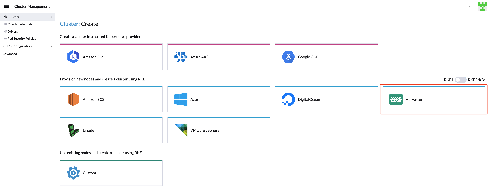
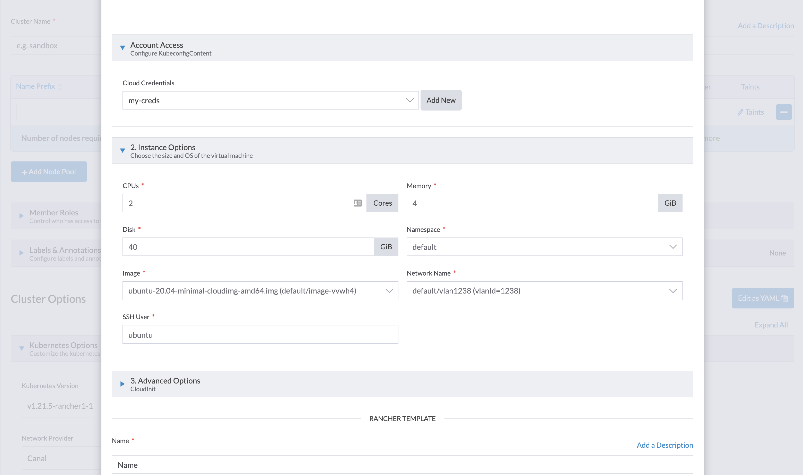
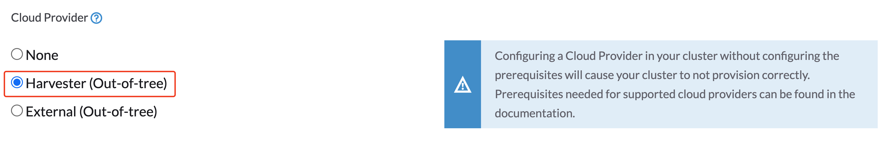
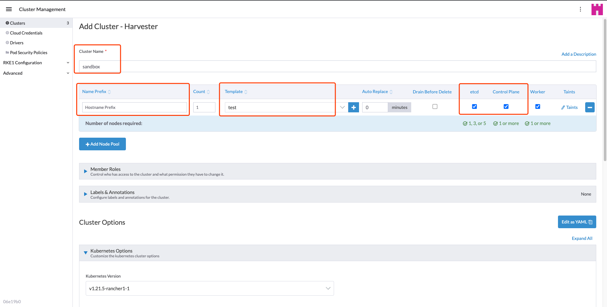

## 概述

你可以使用内置的 Harvester 主机驱动在 Rancher `2.6.3` 中配置在 Harvester 集群之上的 RKE1 Kubernetes 集群。



> 注意：
> Harvester 主机驱动需要 VLAN 网络。

在创建由 Harvester 基础架构托管的 Kubernetes 集群时，[节点模板](https://rancher.com/docs/rancher/v2.6/en/cluster-provisioning/rke-clusters/node-pools/#node-templates)用于配置集群节点。这些模板使用 Docker Machine 配置选项来定义节点的操作系统镜像以及设置/参数。

节点模板可以使用`云凭证`来访问在基础设施提供商中配置节点所需的凭证信息。多个节点模板可以使用相同的`云凭证`。通过使用`云凭证`，你不必为同一云提供商重新输入访问密钥。`云凭证`存储为 Kubernetes 密文。

你可以在两种情况下创建`云凭据`：

- [在为集群创建节点模板期间](https://rancher.com/docs/rancher/v2.6/en/cluster-provisioning/rke-clusters/node-pools/#node-templates)。
- 在"用户设置"页面。

所有`云凭证`都绑定到你的用户配置文件，不能与其他用户共享。

### 创建你的云凭证

1. 单击**☰ > 集群管理**。
1. 单击**云凭证**。
1. 单击**创建**。
1. 单击 **Harvester**.
1. 输入你的云凭证名称。
1. 选择**导入的 Harvester** 或**外部 Harvester**。
1. 单击**创建**。


### 创建节点模板

你可以使用 Harvester 主机驱动为你的 Kubernetes 集群创建节点模板并创建节点池。

1. 配置**云凭证**。
1. 配置**实例选项**：
   * 配置 CPU，内存和磁盘。
   * 选择与 `cloud-init` 配置兼容的操作系统镜像。
   * 选择 主机驱动能够连接的网络，目前仅支持 `VLAN`。
   * 输入 SSH 用户。用户名会用于 SSH 到节点。例如，Ubuntu 云镜像的默认用户将是 `ubuntu`。
1. （可选）如果你需要自定义虚拟机的 cloud-init 配置，设置**高级选项**：
1. 输入 **RANCHER 模板**名称。



详情请参见[基础设施提供商托管的节点](https://rancher.com/docs/rancher/v2.6/en/cluster-provisioning/rke-clusters/node-pools/)。

### 创建 RKE1 Kubernetes 集群

用户可以通过 Harvester RKE1 主机驱动从**集群管理**页面创建 RKE1 Kubernetes 集群。

1. 点击**集群**菜单。
1. 点击**创建**按钮。
1. 切换到 **RKE1**。
1. 选择 Harvester 主机驱动。
1. 输入**集群名称**（必须）。
1. 输入**主机池名称前缀**（必须）。
1. 输入**主机模板**（必须）。
1. 选择 **Etcd** 和 **Control**（必须）。
1. 如果你需要使用 Harvester [云提供商](../cloud-provider/_index)和 [CSI 驱动](../csi-driver/_index)，在**集群选项**中，把`云提供商`配置为`Harvester`。
   
1. 单击**创建**。



### 在离线环境中使用 Harvester RKE1 主机驱动

RKE1 配置依赖 `qemu-guest-agent` 来获取虚拟机的 IP，并依赖 `docker` 来设置 RKE 集群。但是，在离线环境中安装 `qemu-guest-agent` 和 `docker` 可能不可行。

你可以使用以下选项解决安装限制：

选项 1：使用安装了 `qemu-guest-agent` 和 `docker` 的虚拟机镜像。

选项 2：配置 `cloud init` 用户数据，使虚拟机能够通过 HTTP(S) 代理安装 `qemu-guest-agent` 和 `docker`。

Harvester 节点模板中的用户数据示例：
```
#cloud-config
apt:
  http_proxy: http://192.168.0.1:3128
  https_proxy: http://192.168.0.1:3128
write_files:
- path: /etc/environment
  content: |
    HTTP_PROXY="http://192.168.0.1:3128"
    HTTPS_PROXY="http://192.168.0.1:3128"
  append: true
```
