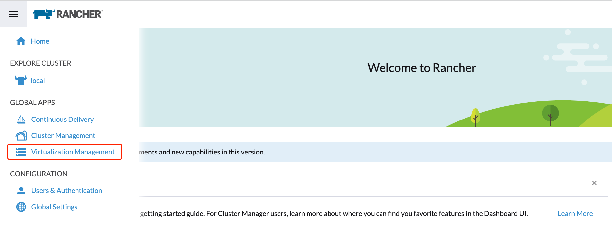
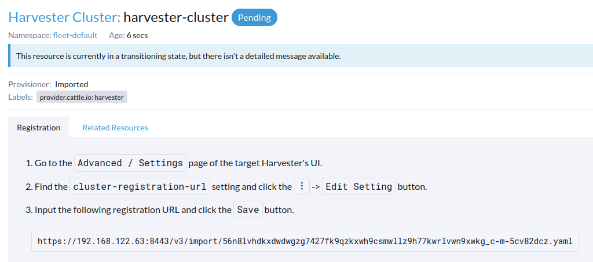
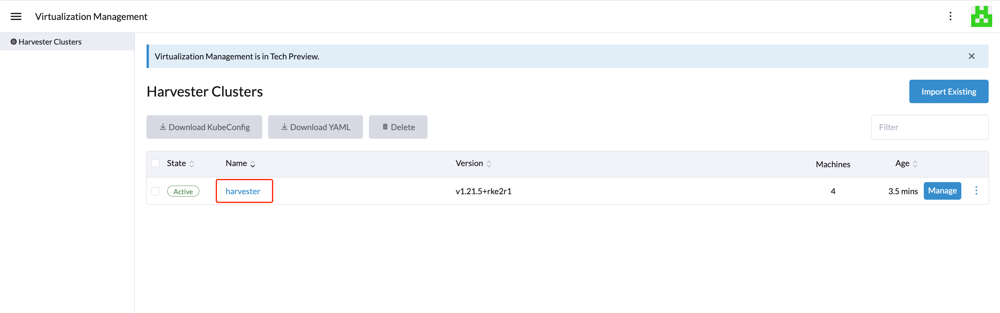
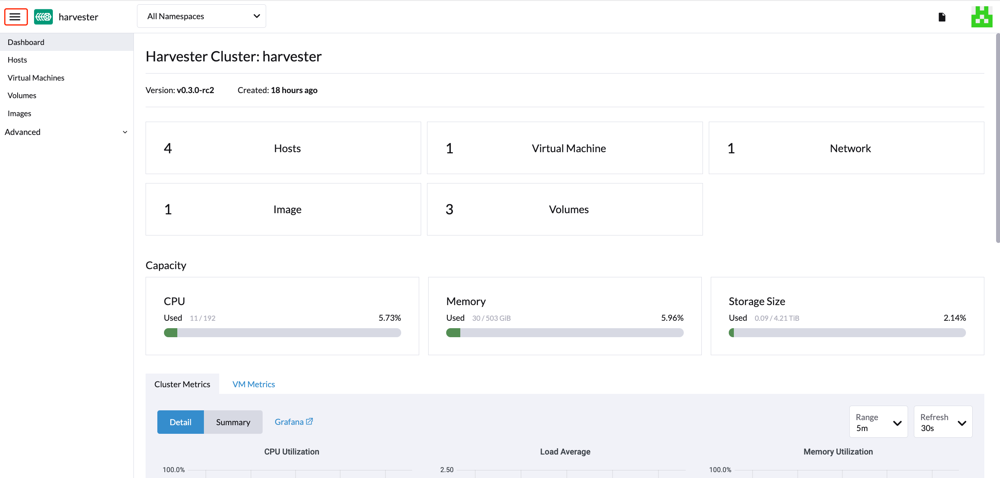
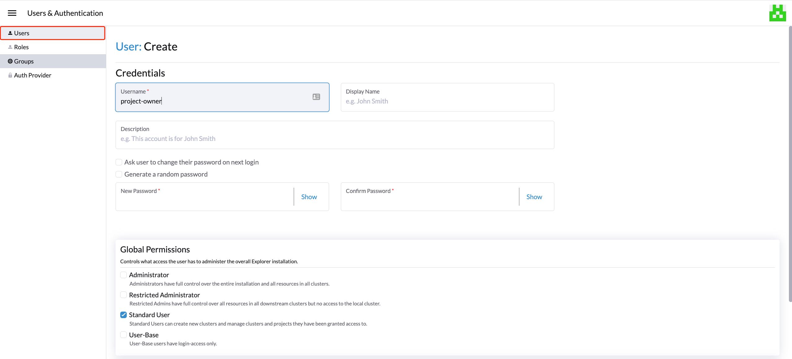
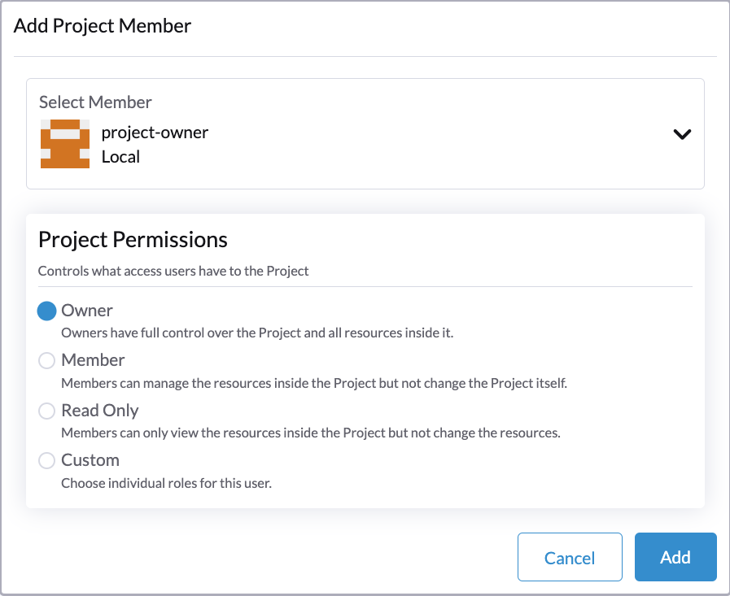
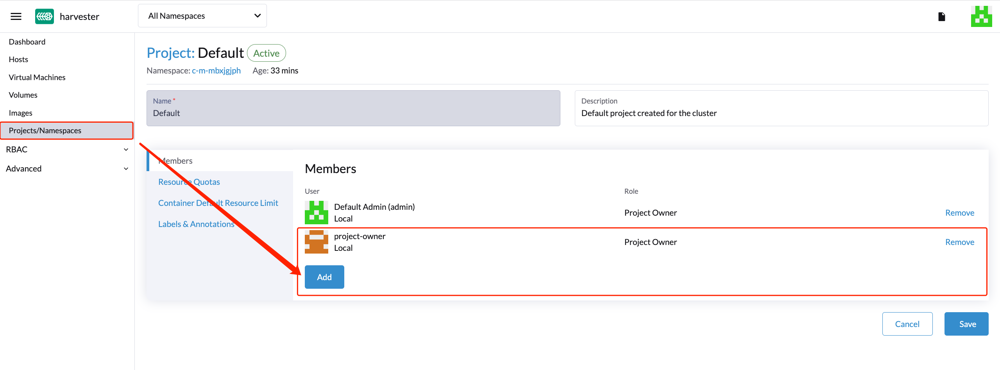
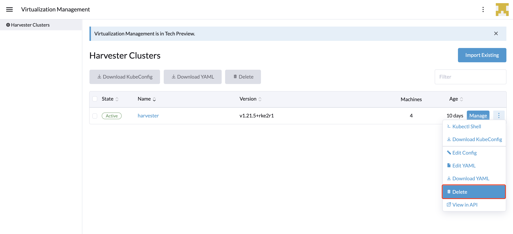

## 概述

对于 Harvester v0.3.0 及更高版本，使用 Rancher v2.6.x 将支持具有多集群管理功能的虚拟化管理。

1. 作为先决条件，你需要创建一个 `v2.6.3` 或更高版本的 Rancher Server，以便与 Harvester `v1.0.0` 集成。如果要进行测试，你可以运行以下 `docker run` 命令启动 Rancher Server：

   ```
   $ sudo docker run -d --restart=unless-stopped -p 80:80 -p 443:443 --privileged rancher/rancher:v2.6.3
   ```

   > 注意
   > 有关生产环境中 Rancher Server 的设置，请参见 [Rancher 官方文档](https://rancher.com/docs/rancher/v2.6/en/quick-start-guide/deployment/)。

1. Rancher Server 正常运行后，你可以登录进去，点击左上角的汉堡菜单，然后选择**虚拟化管理**选项卡。选择**导入已有集群**，将下游 Harvester 集群导入 Rancher Server。
   
1. 指定`集群名称`并单击**创建**。然后你将看到注册指南。请打开目标 Harvester 集群的仪表盘并按照指南进行操作。
   
1. Agent 节点就绪后，你应该能够从 Rancher Server 查看和访问导入的 Harvester 集群，并管理你的虚拟机。
   
1. 在 Harvester UI 中，你可以单击汉堡菜单导航回 Rancher 多集群管理页面。
   

## 多租户

在 Harvester 中，我们利用了现有的 Rancher [RBAC 授权](https://rancher.com/docs/rancher/v2.6/en/admin-settings/rbac/)，以便用户根据他们的集群和项目角色权限查看和管理一组资源。

在 Rancher 中，每个人都验证为一个用户来访问 Rancher。用户可以是本地用户或外部用户（如[身份验证](https://rancher.com/docs/rancher/v2.6/en/admin-settings/authentication/)中所述）。

用户登录到 Rancher 后，他们的授权（也称为访问权限）由全局权限以及集群和项目角色决定。

- [**全局权限**](https://rancher.com/docs/rancher/v2.6/en/admin-settings/rbac/global-permissions/):
  - 在所有特定集群之外定义用户授权。
- [**集群和项目角色**](https://rancher.com/docs/rancher/v2.6/en/admin-settings/rbac/cluster-project-roles/)：
  - 在为用户分配角色的特定集群或项目中定义用户授权。

全局权限以及集群和项目角色都是在 [Kubernetes RBAC](https://kubernetes.io/docs/reference/access-authn-authz/rbac/) 之上实现的。因此，权限和角色由 Kubernetes 执行。

- 集群所有者可以完全控制集群及其内部的所有资源，例如主机、虚拟机、卷、镜像、网络、备份和设置。
- 你可以将项目用户分配到有权限管理项目内部资源的特定项目。

### 多租户示例

以下示例解释了多租户功能的工作原理：

1. 首先，通过 Rancher `用户 & 认证`页面添加新用户。然后点击`创建`添加两个新用户，分别为 `project-owner` 和 `project-readonly`。
   - `project-owner` 是有权管理特定项目（例如默认项目）的资源的用户。
   - `project-readonly` 是具有特定项目（例如默认项目）的只读权限的用户。
     
1. 导航到 Harvester UI 后，单击其中一个导入的 Harvester 集群。
   - 点击`项目/命名空间`选项卡。
   - 选择一个项目（例如 `default`），然后单击`编辑配置`来将用户分配给该项目并分配适当的权限。例如，`project-owner` 用户会被分配到项目所有者角色。
     
1. 继续将 `project-readonly` 用户添加到同一项目中，分配只读权限，然后单击**保存**。
   
1. 打开浏览器的无痕浏览模式，并以 `project-owner` 身份登录。
1. 以 `project-owner` 用户身份登录后，单击**虚拟化管理**选项卡。然后，你将能看到你分配到的集群。
1. 单击**镜像**选项卡以查看之前上传到 harvester-public 命名空间的镜像列表。你也可以按需上传你自己的镜像。
1. 使用你上传的镜像创建一个虚拟机。
1. 使用另一个用户登录（例如 `project-readonly`），这个用户只有这个项目的读权限。

## 删除导入的 Harvester 集群

用户可以在**虚拟化管理 > Harvester 集群**页面，在 Rancher UI 中删除导入的 Harvester 集群。选择要删除的集群，然后单击**删除**按钮，从而删除导入的 Harvester 集群。



> 警告
> 不要运行 `kubectl delete -f ...` 命令来删除导入的 Harvester 集群，因为这将删除 Harvester 集群所需要的整个 `cattle-system` 命名空间。
