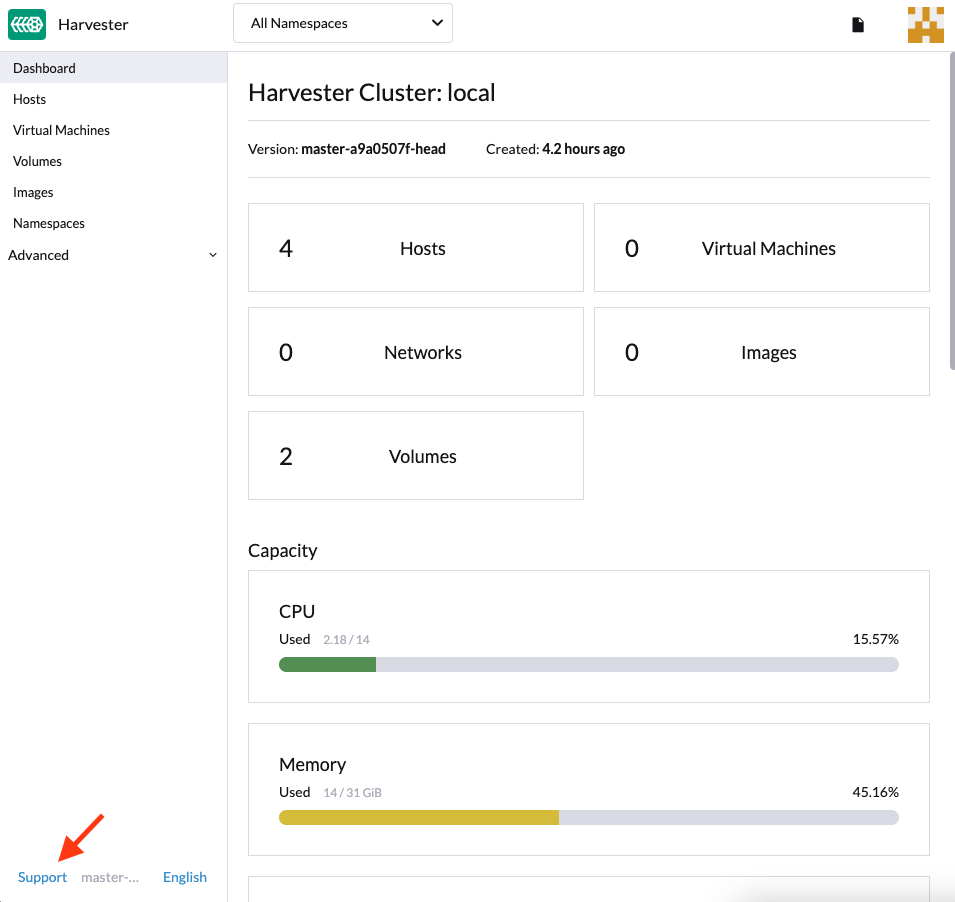
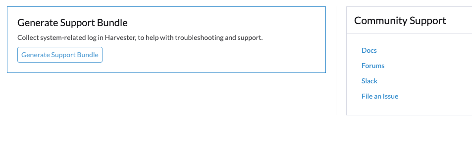
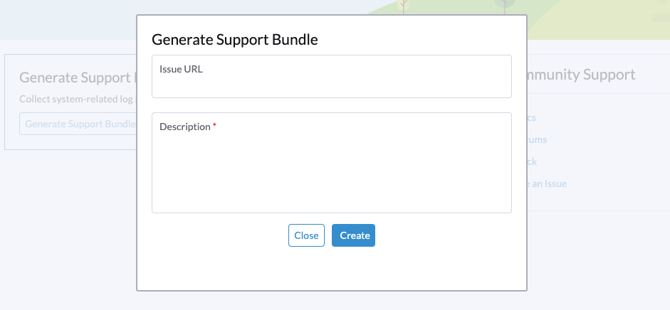

## 生成支持包

你可以按照以下步骤在 Harvester GUI 中生成支持包：

- Harvester 网页 UI 的左下角点击`支持`。
  

- 单击`生成支持包`按钮。
  

- 输入支持包的描述并点击`创建`以生成和下载支持包。
  

## 访问内嵌的 Rancher

你可以通过 `https://{{HARVESTER_IP}}/dashboard/c/local/explorer` 访问内嵌的 Rancher Dashboard。

> 注意：
> 仅支持使用内嵌 Rancher Dashboard 来进行调试和验证。
> 对于 Rancher 的多集群和多租户集成，请参见[文档](../../rancher/_index.md)。

## 访问内嵌的 Longhorn

你可以通过 `https://{{HARVESTER_IP}}/dashboard/c/local/longhorn` 访问内嵌的 Longhorn UI。

> 注意：
> 仅支持使用内嵌 Longhorn UI 来进行调试和验证。

## 修改 SSL/TLS 启用的协议和密码后无法访问 Harvester

如果你修改了 [SSL/TLS 启用的协议和密码设置](../../settings/_index#ssl-parameters)后无法访问 Harvester GUI 和 API，很有可能是由于错误配置的 SSL/TLS 协议和密码导致 NGINX Ingress Controller 停止运行。
请按照以下步骤来进行重置：

1. 按照[常见问题](../../faq/_index.md)的描述 SSH 到 Harvester 节点，并切换成 `root` 用户：

```
$ sudo -s
```

2. 使用 `kubectl` 手动编辑 `ssl-parameters`：

```
# kubectl edit settings ssl-parameters
```

3. 删除 `value: ...` 行，然后 NGINX Ingress Controller 就会使用默认的协议和密码：

```
apiVersion: harvesterhci.io/v1beta1
default: '{}'
kind: Setting
metadata:
  name: ssl-parameters
...
value: '{"protocols":"TLS99","ciphers":"WRONG_CIPHER"}' # <- Delete this line
```

4. 保存修改。退出编辑器后，你会看到以下响应：

```
setting.harvesterhci.io/ssl-parameters edited
```

你也可以进一步检查 `rke2-ingress-nginx-controller` Pod 的日志，来确认 NGINX Ingress Controller 是否能正常运行。
