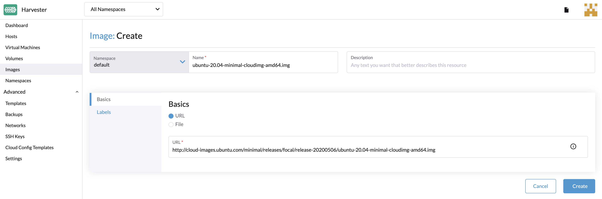
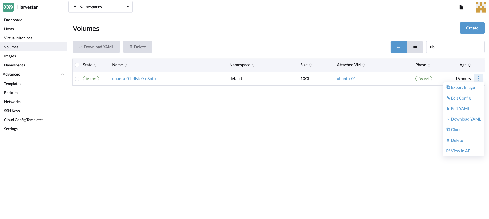

目前支持三种方式创建镜像：通过 URL 上传镜像、通过本地文件上传镜像、通过卷创建镜像。

### 通过 URL 上传镜像

如果需要在**镜像**页面导入虚拟机镜像，输入集群可以访问的 URL。描述和标签是可选的。

> 注意：
> 镜像名称将使用 URL 地址的文件名自动填充。你可以随时自定义镜像的名称。

### 通过本地文件上传镜像

目前支持 qcow2、raw 和 ISO 镜像。

> 注意：
> 在文件上传完成之前，请不要刷新页面，否则会中断退出。

### 通过卷创建镜像

在**卷**页面中，点击**导出镜像**。然后，输入镜像名称来创建镜像。

