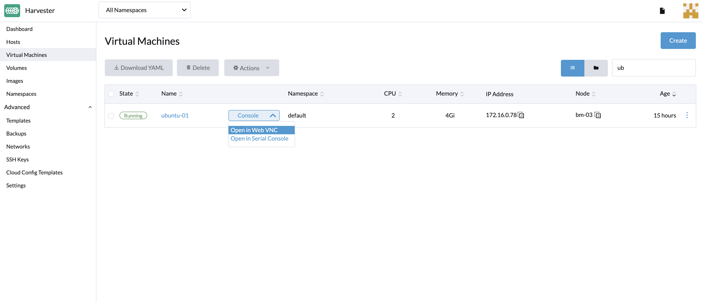

## 概述

虚拟机运行后，你可以在 Harvester UI 通过虚拟网络计算 (VNC) 客户端或串行控制台访问虚拟机。

你也可以直接从电脑的 SSH 客户端连接。

## 使用 Harvester UI 访问

你可以使用 VNC 或串行控制台直接从 UI 访问虚拟机。

如果虚拟机上未启用 VGA 显示，则与 Ubuntu 最小云镜像一样，可以使用串行控制台访问虚拟机。



## 使用 SSH 客户端访问

在终端仿真客户端（如 Putty）中输入主机的 IP 地址。你还可以运行以下命令直接从计算机的 SSH 客户端访问虚拟机：

```
 ssh -i ~/.ssh/your-ssh-key user@<ip-address-or-hostname>
```
