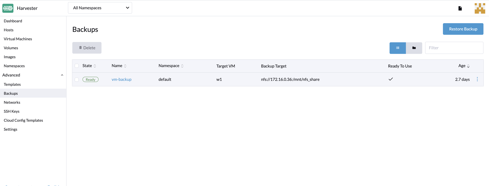
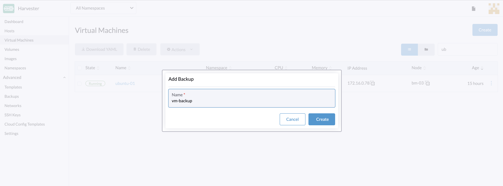

## 概述

_从 v0.3.0 起可用_

虚拟机备份是在**虚拟机**页面中创建的。虚拟机备份卷将存储在**备份目标**（NFS 或 S3 服务器）中，用于还原新虚拟机或替换现有虚拟机。



> 注意：
> 必须设置备份目标。详情请参见[配置备份目标](#configure-backup-target)。如果没有设置备份目标，你会收到进行设置的提示。

## 配置备份目标

备份目标是一个用于访问 Harvester 中的备份存储的端点。备份存储是一个 NFS 服务器或 S3 兼容服务器，用于存储虚拟机卷的备份。备份目标可以在`设置 > backup-target` 中设置。

| 参数               | 类型   | 描述                                                        |
| :----------------- | :----- | :---------------------------------------------------------- |
| Type               | string | 选择 S3 或 NFS                                              |
| Endpoint           | string | 配置服务器或 IP 地址。如果是 AWS S3，则可以留空。               |
| BucketName         | string | Bucket 名称                                                  |
| BucketRegion       | string | Bucket 所在的区域                                            |
| AccessKeyID        | string | 唯一标识你的账号的用户 ID                                   |
| SecretAccessKey    | string | 你账号的密码                                                |
| Certificate        | string | 粘贴以使用 S3 服务器的自签名 SSL 证书。                     |
| VirtualHostedStyle | bool   | 仅使用 `VirtualHostedStyle` 访问，例如阿里云 (Aliyun) OSS。 |

## 创建虚拟机备份

1. 设置好备份目标后，前往`虚拟机`页面。
1. 选择目标虚拟机，并点击 `: > 备份`。
1. 设置备份的名称，并点击`创建`。
   

**结果**：备份已创建。你将收到一条通知消息。你也可以前往`高级选项 > 备份`页面查看所有虚拟机备份。

备份完成后，`可用`状态会设置为 `true`。

你可以使用备份恢复一个新虚拟机，或替换现有虚拟机。

## 使用备份恢复虚拟机

要使用备份恢复一个新虚拟机，请按照以下步骤进行操作：

1. 前往`备份`页面。
1. 设置新虚拟机的名称并单击`创建`。
1. 将使用备份卷和元数据还原新虚拟机。此后，你可以从`虚拟机`页面访问它。
   

## 使用备份替换现有虚拟机

你可以使用具有相同备份目标的备份，来替换现有的虚拟机。

你可以选择删除或保留之前的卷。默认情况下，所有之前的卷都将被删除。

**要求**：虚拟机必须存在且需要处于关机状态。

1. 前往`备份`页面。
1. 单击`创建`。

你可以在`虚拟机`页面查看还原进度。

## 在另一个 Harvester 集群上恢复新虚拟机

_从 v1.0.0 起可用_

用户现在可以使用虚拟机元数据和内容备份功能，在另一个集群上恢复新虚拟机。

> 前提
> 你必须先在新集群上手动配置同名的虚拟机镜像，否则将无法正常恢复。

### 将相同的虚拟机镜像上传到新集群

1. 检查现有镜像的名称（通常以 `image-` 开头），并在新集群上创建相同的名称：

```
$ kubectl get vmimages -A
NAMESPACE   NAME                               DISPLAY-NAME                              SIZE         AGE
default     image-79hdq                        focal-server-cloudimg-amd64.img           566886400    5h36m
default     image-l7924                        harvester-v1.0.0-rc2-amd64.iso            3964551168   137m
default     image-lvqxn                        opensuse-leap-15.3.x86_64-nocloud.qcow2   568524800    5h35m
```

2. 在新集群中应用具有相同名称和内容的虚拟机镜像 YAML：

```
$ cat <<EOF | kubectl apply -f -
apiVersion: harvesterhci.io/v1beta1
kind: VirtualMachineImage
metadata:
  name: image-lvqxn
  namespace: default
spec:
  displayName: opensuse-leap-15.3.x86_64-nocloud.qcow2
  pvcName: ""
  pvcNamespace: ""
  sourceType: download
  url: http://download.opensuse.org/repositories/Cloud:/Images:/Leap_15.3/images/openSUSE-Leap-15.3.x86_64-NoCloud.qcow2
EOF
```

### 在新集群中恢复新虚拟机

1. 在新集群中设置相同的备份目标。此后，备份控制器会自动将备份元数据同步到新集群。
2. 前往`备份`页面。
3. 选择已同步的虚拟机备份元数据，然后选择使用指定的虚拟机名称还原新的虚拟机。
4. 新的虚拟机将使用备份卷和元数据进行还原。你可以在`虚拟机`页面访问虚拟机。
