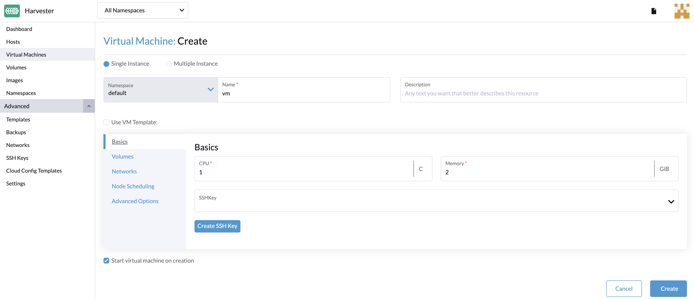
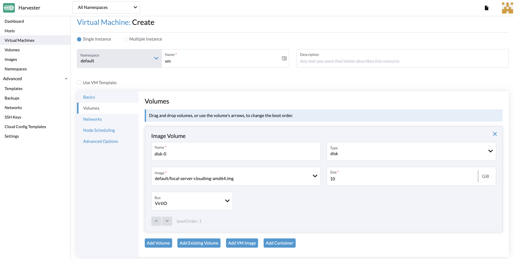

## 如何创建虚拟机

从**虚拟机**页面创建一个或多个虚拟机。

> 注意：
> 如果需要创建 Windows 虚拟机，请参见[本页面](../create-windows-vm/_index.md)。

1. 选择创建`单个实例`或`多个实例`。
1. 输入虚拟机名称（必填）。
1. 使用虚拟机模板（可选）。你可以选择 ISO，raw，或 Windows 镜像模板作为默认选项。
1. 配置虚拟机的 CPU 和内存。
1. 选择 SSH 密钥或上传新密钥。
1. 在**卷**选项卡上选择自定义虚拟机镜像卷。默认磁盘将是根磁盘。你可以向虚拟机添加更多磁盘。
1. 如果需要配置网络，前往**网络**选项卡。默认情况下会添加 **Management Network**。你也可以使用 VLAN 网络向虚拟机添加辅助网络。请在**高级选项 > 网络数据**中进行配置。
1. 主机名和 cloud-init 数据等高级选项是可选的。你可以在**高级选项**选项卡中进行配置。





## Cloud-init 配置示例

默认用户的密码配置：

```YAML
# cloud-config
password: password
chpasswd: { expire: False }
ssh_pwauth: True
```

使用 DHCP 进行网络数据配置：

```YAML
version: 1
config:
  - type: physical
    name: eth0
    subnets:
      - type: dhcp
  - type: physical
    name: eth1
    subnets:
      - type: dhcp
```

你还可以使用 `Cloud Config 模板` 功能，来为虚拟机使用预设的 cloud-init 配置。

## 网络

### 管理网络

管理网络是每个集群的默认网络，它可以为虚拟机的 eth0 网卡网络提供一个集群内可以访问的网络解决方案（如果虚拟机重启默认分配的IP将会发生变化）。

默认情况下，可以通过管理网络来访问虚拟机。

### 其他网络

你也可以使用 Harvester 的内置 [VLAN 网络](../../networking/_index.md) 来辅助网络连接虚拟机。
