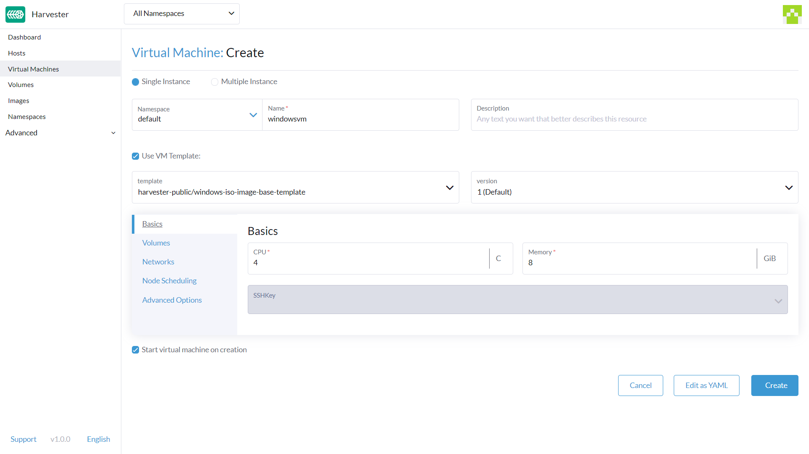
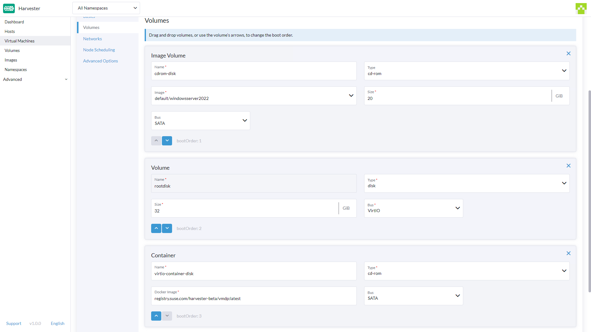
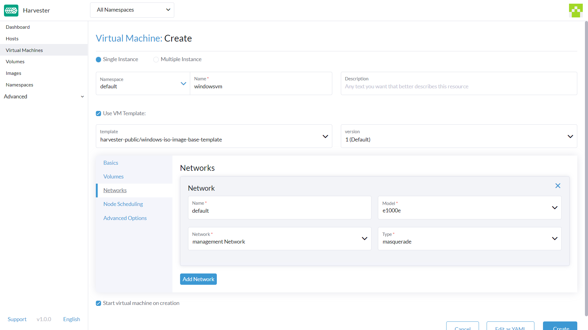
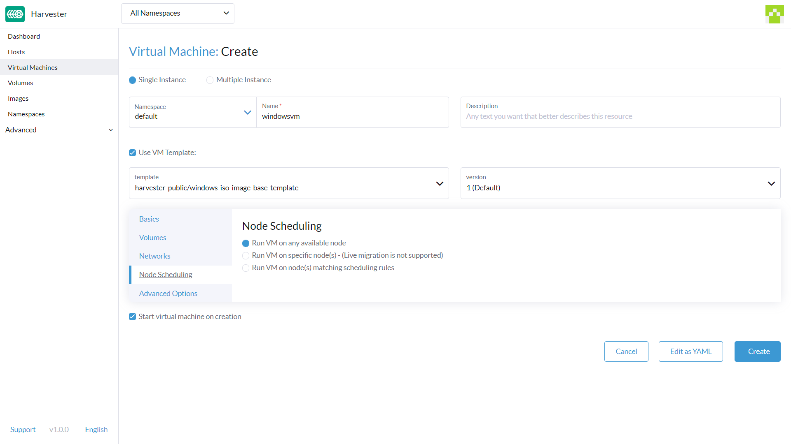
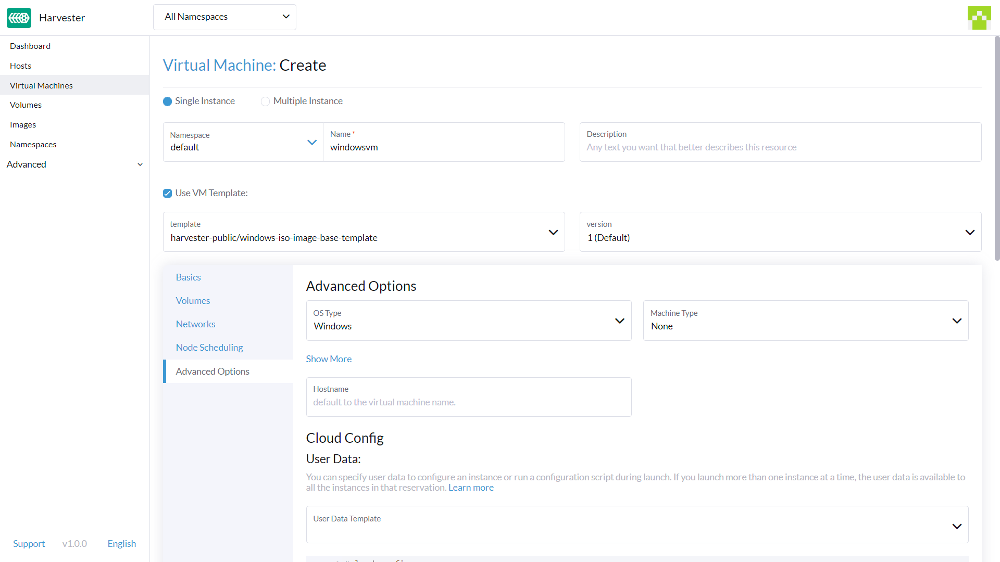

## 概述

本文描述如何通过**虚拟机**页面创建一个或多个 Windows 虚拟机。

> 注意：
> 如果需要创建 Linux 虚拟机，请参见[本页面](../create-vm/_index.md)。

## 标题部分

1. 选择创建`单个实例`或`多个实例`。
1. 设置虚拟机名称。
1. （可选）输入虚拟机的描述。
1. （可选）选择`使用虚拟机模板`并选择 `windows-iso-image-base-template`。此模板将为 Windows 添加带有 `virtio` 驱动的卷。

## 基本信息选项卡

1. 配置要分配给虚拟机的 `CPU` 核数。
1. 配置要分配给虚拟机的`内存`。
1. （可选）选择现有的 `SSH密钥`或上传新的密钥​​。

> 注意：
> 如上所述，建议你使用 Windows 虚拟机模板。`卷`部分将描述 Windows 虚拟机模板自动创建的选项。

> 警告：
> `bootOrder` 值需要先使用安装镜像进行设置。如果你修改这些值，你的虚拟机可能无法启动到安装磁盘。

## 卷选项卡

1. **第一个卷**是一个`镜像卷`，具有以下值：
   1. `名称`：默认设置为 `cdrom-disk`。你也可以修改它。
   2. `镜像`：选择要安装的 Windows 镜像。有关如何创建新镜像的完整说明，请参见[上传镜像](../../upload-image/_index)。
   3. `类型`：选择 `cd-rom`。
   4. `大小`：默认值是 `20`。如果你的镜像较大，你可以更改该值。
   5. `Bus`：默认值是 `SATA`。建议你不要修改该值。
2. **第二个卷**是具有以下值的`卷`：
   1. `名称`：默认设置为 `rootdisk`。你也可以修改它。
   2. `大小`：默认值是 `32`。在更改此值之前，请参见 [Windows Server](https://docs.microsoft.com/en-us/windows-server/get-started/hardware-requirements#storage-controller-and-disk-space-requirements) 和 [Windows 11](https://docs.microsoft.com/en-us/windows/whats-new/windows-11-requirements#hardware-requirements) 的磁盘空间要求。
   3. `Bus`：默认值是 `VirtIO`。你也可以将它修改为其他可用的选项，例如 `SATA` 或 `SCSI`。
3. **第三个卷**是具有以下值的`容器` ：
   1. `名称`：默认设置为 `virtio-container-disk`。你也可以修改它。
   2. `Docker 镜像`：默认设置为 `registry.suse.com/harvester-beta/vmdp:latest`。建议你不要修改该值。
   3. `Bus`：默认值是 `SATA`。建议你不要修改该值。
4. 你可以使用`添加卷`、`添加现有卷`、`添加虚拟机镜像`或`添加容器`按钮来添加其他磁盘.

## 网络选项卡

1. **Management Network** 默认添加，并带有以下值：
   1. `名称`：默认设置为 `default`。你也可以修改它。
   2. `网络`：默认值是 `management Network`。如果尚未创建其他网络，则无法更改此选项。有关如何创建新网络的完整说明，请参见 [Harvester 网络](../../networking/_index.md)。
   3. `模式`：默认设置为 `e1000`。你也可以将其设为下拉菜单中的其他可用选项。
   4. `类型`：默认值是 `masquerade`。你也可以将其设置为 `bridge`。
2. 你可以点击`添加网络`来添加其他网络。

> 警告：
> 更改`节点调度`设置可能会影响 Harvester 功能，例如禁用`热迁移`。

## 节点调度选项卡

1. `节点调度`默认设置为`在任何可用节点上运行虚拟机`。你也可以将其设为下拉菜单中的其他可用选项。

## 高级选项选项卡

1. `操作系统类型`：默认设置为`Windows`。建议你不要修改该值。
2. `机器类型`：默认设置为 `None`。建议你不要修改该值。在更改此值之前，请参见 [KubeVirt 机器类型](https://kubevirt.io/user-guide/virtual_machines/virtual_hardware/#machine-type)文档。
3. （可选）`主机名`：设置虚拟机的主机名。
4. （可选）`Cloud Config`：`用户数据`和`网络数据`值均使用为默认值。目前，这些配置不适用于基于 Windows 的虚拟机。

## 页脚部分

1. `创建后启动虚拟机`：此选项默认勾选。如果你不希望虚拟机在创建后启动，你可以取消勾选它。

完成所有设置后，单击`创建`来创建虚拟机。

> 注意：
> 如果你需要添加高级设置，你可以点击`以 YAML 文件编辑`来直接修改虚拟机配置。
> 如果你需要取消所有更改，点击`取消`。