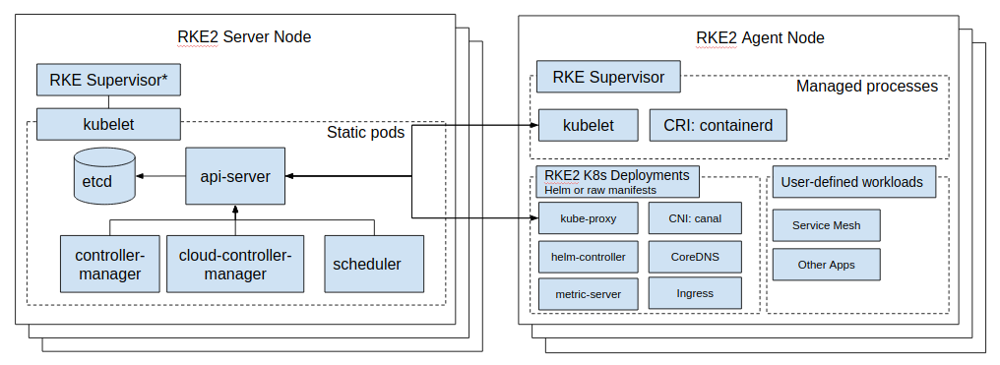

## 架构概述

在 RKE2 中，我们吸取了开发和维护轻量级[Kubernetes][io-kubernetes]发行版[K3s][io-k3s]的经验教训，并将其应用于构建一个具有[K3s][io-k3s]易用性的企业级发行版。这意味着，RKE2 在最简单的情况下是一个单一的二进制文件，需要在所有参与[Kubernetes][io-kubernetes]集群的节点上安装和配置。一旦启动，RKE2 就能够引导和监督每个节点上的角色合适的 agent，同时从网络上获取所需的内容。

RKE2 汇集了一些开源技术来实现这一切：

- [K3s][io-k3s]
  - [Helm Controller][gh-helm-controller]
- [K8s][io-kubernetes]
  - [API Server][gh-kube-apiserver]
  - [Controller Manager][gh-kube-controller-manager]
  - [Kubelet][gh-kubelet]
  - [Scheduler][gh-kube-scheduler]
  - [Proxy][gh-kube-proxy]
- [etcd][io-etcd]
- [runc][gh-runc]
- [containerd][io-containerd]/[cri][gh-cri-api]
- CNI][gh-cni]: Canal ([Calico][org-projectcalico] ; [Flannel][gh-flannel]), [Cilium][io-cilium] 或 [Calico][org-projectcalico]
- [CoreDNS][io-coredns]
- [NGINX Ingress Controller][io-ingress-nginx]
- [Metrics Server][gh-metrics-server]
- [Helm][sh-helm]

除了 NGINX Ingress Controller，所有这些都是用[Go+BoringCrypto][gh-goboring]编译和静态链接的。

## 进程生命周期

### Content Bootstrap

RKE2 从 RKE2 Runtime 镜像中提取二进制文件和清单来运行*server*和*agent*节点。这意味着 RKE2 默认扫描`/var/lib/rancher/rke2/agent/images/*.tar`以获取[`rancher/rke2-runtime`](https://hub.docker.com/r/rancher/rke2-runtime/tags)镜像（带有与 `rke2 --version` 输出相关的标签），如果找不到它，就尝试从网络（也就是 Docker Hub）上拉取。RKE2 然后从镜像中提取`/bin/`，将其解压到`/var/lib/rancher/rke2/data/${RKE2_DATA_KEY}/bin`，其中`${RKE2_DATA_KEY}`代表识别镜像的唯一字符串。

为了使 RKE2 能够如期工作，运行时镜像必须至少提供：

- **`containerd`** ([CRI][gh-cri-api])
- **`containerd-shim`** (shims wrap `runc` 任务，并且在 `containerd` 执行时不会停止)
- **`containerd-shim-runc-v1`**
- **`containerd-shim-runc-v2`**
- **`kubelet`** (Kubernetes 节点 agent)
- **`runc`** (OCI runtime)

运行时镜像还提供了以下 ops 工具：

- **`ctr`** (低级别的`containerd`维护和检查)
- **`crictl`** (低级别的 CRI 维护和检查)
- **`kubectl`** (kubernetes 集群维护和检查)
- **`socat`** (由`containerd`需要，用于端口转发)

在二进制文件被提取后，RKE2 将从镜像中提取 `charts` 到`/var/lib/rancher/rke2/server/manifests`目录。

### 初始化 Server

在嵌入式 K3s 引擎中，server 是专门的 agent 进程，这意味着后续启动将推迟到节点容器运行时启动。

#### 组件准备

##### `kube-apiserver`

拉取 `kube-apiserver` 镜像（如果不存在），并启动一个 goroutine 来等待 `etcd`，然后在`/var/lib/rancher/rke2/agent/pod-manifests/`中写入静态 pod 定义。

##### `kube-controller-manager`

拉取 `kube-controller-manager` 镜像（如果不存在），并启动一个 goroutine 来等待`kube-apiserver`，然后在`/var/lib/rancher/rke2/agent/pod-manifests/`中写入静态 pod 定义。

##### `kube-scheduler`

拉取 `kube-scheduler` 镜像（如果不存在），并启动一个 goroutine 来等待 `kube-apiserver`，然后在`/var/lib/rancher/rke2/agent/pod-manifests/`中写入静态 pod 定义。

#### 启动群集

在一个 goroutine 中启动一个 HTTP 服务器，以监听其他集群 server/agent，然后初始化/加入集群。

##### `etcd `

拉取 `etcd` 镜像（如果不存在），启动一个 goroutine 来等待 `kubelet`，然后在`/var/lib/rancher/rke2/agent/pod-manifests/`中写入静态 pod 定义。

##### `helm-controller`。

在等待`kube-apiserver`准备就绪后，启动 goroutine 来启动嵌入式 `helm-controller`。

### 初始化 Agent

Agent 进程的入口点。对于 server 进程，嵌入式 K3s 引擎直接调用它。

#### 容器运行时间

##### `containerd`

生成`containerd`进程并监听终止。如果`containerd`退出，那么`rke2`进程也将退出。

#### 节点 Agent

##### `kubelet`

生成并监督`kubelet`进程。如果`kubelet`退出，那么`rke2`将尝试重新启动它。一旦 `kubelet` 运行，它将启动任何可用的静态 pod。对于 server 来说，这意味着`etcd`和`kube-apiserver`将依次启动，允许其余通过静态 pod 启动的组件连接到`kube-apiserver`并开始处理。

#### Server Charts

在 server 节点上，`helm-controller`可以将在`/var/lib/rancher/rke2/server/manifests`中找到的任何 charts 应用到集群中。

- rke2-canal.yaml or rke2-cilium.yaml (daemonset, bootstrap)
- rke2-coredns.yaml (deployment, bootstrap)
- rke2-ingress-nginx.yaml (deployment)
- rke2-kube-proxy.yaml (daemonset, bootstrap)
- rke2-metrics-server.yaml (deployment)

### Daemon Process

RKE2 进程现在将无限期地运行，直到它收到 SIGTERM 或 SIGKILL 或者`containerd`进程退出。

[gh-k3s]: https://github.com/k3s-io/k3s "K3s - Lightweight Kubernetes"
[io-k3s]: https://k3s.io "K3s - Lightweight Kubernetes"
[gh-kubernetes]: https://github.com/kubernetes/kubernetes "Production-Grade Container Orchestration"
[io-kubernetes]: https://kubernetes.io "Production-Grade Container Orchestration"
[gh-kube-apiserver]: https://github.com/kubernetes/kubernetes/tree/master/cmd/kube-apiserver "Kube API Server"
[gh-kube-controller-manager]: https://github.com/kubernetes/kubernetes/tree/master/cmd/kube-controller-manager "Kube Controller Manager"
[gh-kube-proxy]: https://github.com/kubernetes/kubernetes/tree/master/cmd/kube-proxy "Kube Proxy"
[gh-kube-scheduler]: https://github.com/kubernetes/kubernetes/tree/master/cmd/kube-scheduler "Kube Scheduler"
[gh-kubelet]: https://github.com/kubernetes/kubernetes/tree/master/cmd/kubelet "Kubelet"
[gh-cri-api]: https://github.com/kubernetes/cri-api "Container Runtime Interface"
[gh-containerd]: https://github.com/containerd/containerd "An open and reliable container runtime"
[io-containerd]: https://containerd.io "An open and reliable container runtime"
[gh-coredns]: https://github.com/coredns/coredns "DNS and Service Discovery"
[io-coredns]: https://coredns.io "DNS and Service Discovery"
[gh-ingress-nginx]: https://github.com/kubernetes/ingress-nginx "NGINX Ingress Controller for Kubernetes"
[io-ingress-nginx]: https://kubernetes.github.io/ingress-nginx "NGINX Ingress Controller for Kubernetes"
[gh-metrics-server]: https://github.com/kubernetes-sigs/metrics-server "Cluster-wide aggregator of resource usage data"
[org-projectcalico]: https://docs.projectcalico.org/about/about-calico "Project Calico"
[gh-flannel]: https://github.com/coreos/flannel "A network fabric for containers, designed for Kubernetes"
[io-cilium]: https://cilium.io "eBPF-based Networking, Observability, and Security"
[gh-etcd]: https://github.com/etcd-io/etcd "A distributed, reliable key-value store for the most critical data of a distributed system"
[io-etcd]: https://etcd.io "A distributed, reliable key-value store for the most critical data of a distributed system"
[gh-helm]: https://github.com/helm/helm "The Kubernetes Package Manager"
[sh-helm]: https://helm.sh "The Kubernetes Package Manager"
[gh-helm-controller]: https://github.com/k3s-io/helm-controller "Helm Chart CRD"
[gh-cni]: https://github.com/containernetworking/cni "Container Network Interface"
[gh-runc]: https://github.com/opencontainers/runc "CLI tool for spawning and running containers according to the OCI specification"
[gh-goboring]: https://github.com/golang/go/tree/dev.boringcrypto/misc/boring "Go+BoringCrypto"
